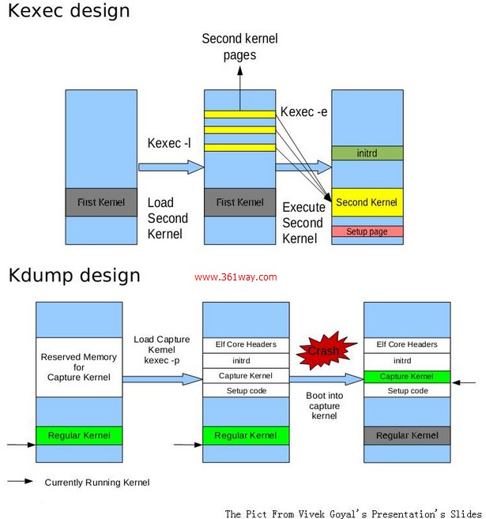

# crash
linux kernel coredump analysis

## 目录

* [基础知识](docs/基础知识.md)
    * [kdump](docs/基础知识/kdump.md)
    * [crash](docs/基础知识/crash.md)
* [源码分析](docs/源码分析.md)
    * [kexec系统调用](docs/源码分析/kexec系统调用.md)
    * [kexec用户态程序](docs/源码分析/kexec用户态程序.md)
    * [kdump服务](docs/源码分析/kdump服务.md)
* [问题分类](docs/问题分类.md)
    * [Oops](docs/问题分类/Oops.md)
    * [panic](docs/问题分类/panic.md)
    * [soft-lockup](docs/问题分类/soft-lockup.md)
    * [hard-locakup](docs/问题分类/hard-locakup.md)
* [案例](docs/案例.md)

## 图示

---
