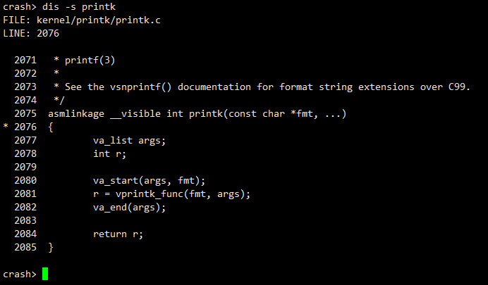

# dis

## 概述


## 举例子


## 帮助信息

* <https://crash-utility.github.io/help_pages/dis.html>


```
NAME
  dis - disassemble

SYNOPSIS
  dis [-rfludxs][-b [num]] [address | symbol | (expression)] [count]

DESCRIPTION
  This command disassembles source code instructions starting (or ending) at
  a text address that may be expressed by value, symbol or expression:

            -r  (reverse) displays all instructions from the start of the
                routine up to and including the designated address.
            -f  (forward) displays all instructions from the given address
                to the end of the routine.
            -l  displays source code line number data in addition to the
                disassembly output.
            -u  address is a user virtual address in the current context;
                otherwise the address is assumed to be a kernel virtual address.
                If this option is used, then -r and -l are ignored.
            -x  override default output format with hexadecimal format.
            -d  override default output format with decimal format.
            -s  displays the filename and line number of the source code that
                is associated with the specified text location, followed by a
                source code listing if it is available on the host machine.
                The line associated with the text location will be marked with
                an asterisk; depending upon gdb's internal "listsize" variable,
                several lines will precede the marked location. If a "count"
                argument is entered, it specifies the number of source code
                lines to be displayed after the marked location; otherwise
                the remaining source code of the containing function will be
                displayed.
      -b [num]  modify the pre-calculated number of encoded bytes to skip after
                a kernel BUG ("ud2a") instruction; with no argument, displays
                the current number of bytes being skipped. (x86 and x86_64 only)
       address  starting hexadecimal text address.
        symbol  symbol of starting text address.  On ppc64, the symbol
                preceded by '.' is used.
  (expression)  expression evaluating to a starting text address.
         count  the number of instructions to be disassembled (default is 1).
                If no count argument is entered, and the starting address
                is entered as a text symbol, then the whole routine will be
                disassembled.  The count argument is supported when used with
                the -r and -f options.

EXAMPLES
  Disassemble the sys_signal() routine without, and then with, line numbers:

    crash> dis sys_signal
    0xc0112c88 <sys_signal>:        push   %ebp
    0xc0112c89 <sys_signal+1>:      mov    %esp,%ebp
    0xc0112c8b <sys_signal+3>:      sub    $0x28,%esp
    0xc0112c8e <sys_signal+6>:      mov    0xc(%ebp),%eax
    0xc0112c91 <sys_signal+9>:      mov    %eax,0xffffffec(%ebp)
    0xc0112c94 <sys_signal+12>:     movl   $0xc0000000,0xfffffff0(%ebp)
    0xc0112c9b <sys_signal+19>:     lea    0xffffffd8(%ebp),%eax
    0xc0112c9e <sys_signal+22>:     push   %eax
    0xc0112c9f <sys_signal+23>:     lea    0xffffffec(%ebp),%eax
    0xc0112ca2 <sys_signal+26>:     push   %eax
    0xc0112ca3 <sys_signal+27>:     pushl  0x8(%ebp)
    0xc0112ca6 <sys_signal+30>:     call   0xc01124b8 <do_sigaction>
    0xc0112cab <sys_signal+35>:     test   %eax,%eax
    0xc0112cad <sys_signal+37>:     jne    0xc0112cb2 <sys_signal+42>
    0xc0112caf <sys_signal+39>:     mov    0xffffffd8(%ebp),%eax
    0xc0112cb2 <sys_signal+42>:     leave
    0xc0112cb3 <sys_signal+43>:     ret

    crash> dis -l sys_signal
    /usr/src/linux-2.2.5/kernel/signal.c: 1074
    0xc0112c88 <sys_signal>:        push   %ebp
    0xc0112c89 <sys_signal+1>:      mov    %esp,%ebp
    0xc0112c8b <sys_signal+3>:      sub    $0x28,%esp
    0xc0112c8e <sys_signal+6>:      mov    0xc(%ebp),%eax
    /usr/src/linux-2.2.5/kernel/signal.c: 1078
    0xc0112c91 <sys_signal+9>:      mov    %eax,0xffffffec(%ebp)
    /usr/src/linux-2.2.5/kernel/signal.c: 1079
    0xc0112c94 <sys_signal+12>:     movl   $0xc0000000,0xfffffff0(%ebp)
    /usr/src/linux-2.2.5/kernel/signal.c: 1081
    0xc0112c9b <sys_signal+19>:     lea    0xffffffd8(%ebp),%eax
    0xc0112c9e <sys_signal+22>:     push   %eax
    0xc0112c9f <sys_signal+23>:     lea    0xffffffec(%ebp),%eax
    0xc0112ca2 <sys_signal+26>:     push   %eax
    0xc0112ca3 <sys_signal+27>:     pushl  0x8(%ebp)
    0xc0112ca6 <sys_signal+30>:     call   0xc01124b8 <do_sigaction>
    /usr/src/linux-2.2.5/kernel/signal.c: 1083
    0xc0112cab <sys_signal+35>:     test   %eax,%eax
    0xc0112cad <sys_signal+37>:     jne    0xc0112cb2 <sys_signal+42>
    0xc0112caf <sys_signal+39>:     mov    0xffffffd8(%ebp),%eax
    /usr/src/linux-2.2.5/kernel/signal.c: 1084
    0xc0112cb2 <sys_signal+42>:     leave
    0xc0112cb3 <sys_signal+43>:     ret

  Given a return address expression of "do_no_page+65", find out the
  function that do_no_page() calls by using the reverse flag:

    crash> dis -r (do_no_page+65)
    0xc011ea68 <do_no_page>:        push   %ebp
    0xc011ea69 <do_no_page+1>:      mov    %esp,%ebp
    0xc011ea6b <do_no_page+3>:      push   %edi
    0xc011ea6c <do_no_page+4>:      push   %esi
    0xc011ea6d <do_no_page+5>:      push   %ebx
    0xc011ea6e <do_no_page+6>:      mov    0xc(%ebp),%ebx
    0xc011ea71 <do_no_page+9>:      mov    0x10(%ebp),%edx
    0xc011ea74 <do_no_page+12>:     mov    0x14(%ebp),%edi
    0xc011ea77 <do_no_page+15>:     mov    0x28(%ebx),%eax
    0xc011ea7a <do_no_page+18>:     test   %eax,%eax
    0xc011ea7c <do_no_page+20>:     je     0xc011ea85 <do_no_page+29>
    0xc011ea7e <do_no_page+22>:     mov    0x18(%eax),%ecx
    0xc011ea81 <do_no_page+25>:     test   %ecx,%ecx
    0xc011ea83 <do_no_page+27>:     jne    0xc011eab0 <do_no_page+72>
    0xc011ea85 <do_no_page+29>:     mov    $0xffffe000,%eax
    0xc011ea8a <do_no_page+34>:     and    %esp,%eax
    0xc011ea8c <do_no_page+36>:     decl   0x30(%eax)
    0xc011ea8f <do_no_page+39>:     jns    0xc011ea9a <do_no_page+50>
    0xc011ea91 <do_no_page+41>:     lock btrl $0x0,0xc022fb60
    0xc011ea9a <do_no_page+50>:     push   %edi
    0xc011ea9b <do_no_page+51>:     mov    0x18(%ebp),%esi
    0xc011ea9e <do_no_page+54>:     push   %esi
    0xc011ea9f <do_no_page+55>:     push   %ebx
    0xc011eaa0 <do_no_page+56>:     mov    0x8(%ebp),%esi
    0xc011eaa3 <do_no_page+59>:     push   %esi
    0xc011eaa4 <do_no_page+60>:     call   0xc011e9e4 <do_anonymous_page>
    0xc011eaa9 <do_no_page+65>:     jmp    0xc011eb47 <do_no_page+223>

  Disassemble 10 instructions starting at user virtual address 0x81ec624:

    crash> dis -u 81ec624 10
    0x81ec624:      push   %ebp
    0x81ec625:      mov    %esp,%ebp
    0x81ec627:      sub    $0x18,%esp
    0x81ec62a:      movl   $0x1,0x8(%ebp)
    0x81ec631:      mov    0x82f9040,%eax
    0x81ec636:      mov    0x10(%eax),%edx
    0x81ec639:      and    $0x100,%edx
    0x81ec63f:      mov    0x14(%eax),%ecx
    0x81ec642:      and    $0x0,%ecx
    0x81ec645:      mov    %ecx,%eax

  Override the current decimal output radix format:

    crash> dis sys_read 10 -x
    0xffffffff8001178f <sys_read>:  push   %r13
    0xffffffff80011791 <sys_read+0x2>:    mov    %rsi,%r13
    0xffffffff80011794 <sys_read+0x5>:    push   %r12
    0xffffffff80011796 <sys_read+0x7>:    mov    $0xfffffffffffffff7,%r12
    0xffffffff8001179d <sys_read+0xe>:    push   %rbp
    0xffffffff8001179e <sys_read+0xf>:    mov    %rdx,%rbp
    0xffffffff800117a1 <sys_read+0x12>:   push   %rbx
    0xffffffff800117a2 <sys_read+0x13>:   sub    $0x18,%rsp
    0xffffffff800117a6 <sys_read+0x17>:   lea    0x14(%rsp),%rsi
    0xffffffff800117ab <sys_read+0x1c>:   callq  0xffffffff8000b5b4 <fget_light>

  Disassemble from vfs_read+320 until the end of the function:

    crash> dis -f vfs_read+320
    0xffffffff8119d4e0 <vfs_read+320>:  cmpq   $0x0,0x20(%rax)
    0xffffffff8119d4e5 <vfs_read+325>:  jne    0xffffffff8119d3e8 <vfs_read+72>
    0xffffffff8119d4eb <vfs_read+331>:  mov    $0xffffffffffffffea,%r12
    0xffffffff8119d4f2 <vfs_read+338>:  jmp    0xffffffff8119d4c3 <vfs_read+291>
    0xffffffff8119d4f4 <vfs_read+340>:  nopl   0x0(%rax)
    0xffffffff8119d4f8 <vfs_read+344>:  callq  0xffffffff8119cc40 <do_sync_read>
    0xffffffff8119d4fd <vfs_read+349>:  mov    %rax,%r12
    0xffffffff8119d500 <vfs_read+352>:  jmpq   0xffffffff8119d44c <vfs_read+172>
    0xffffffff8119d505 <vfs_read+357>:  nopl   (%rax)
    0xffffffff8119d508 <vfs_read+360>:  mov    $0xfffffffffffffff7,%r12
    0xffffffff8119d50f <vfs_read+367>:  jmp    0xffffffff8119d4c3 <vfs_read+291>
    0xffffffff8119d511 <vfs_read+369>:  mov    $0xfffffffffffffff2,%r12
    0xffffffff8119d518 <vfs_read+376>:  jmp    0xffffffff8119d4c3 <vfs_read+291>
    0xffffffff8119d51a <vfs_read+378>:  nopw   0x0(%rax,%rax,1)

  Display the source code listing of the mmput() function:

    crash> dis -s mmput
    FILE: kernel/fork.c
    LINE: 617

      612   
      613   /*
      614    * Decrement the use count and release all resources for an mm.
      615    */
      616   void mmput(struct mm_struct *mm)
    * 617   {
      618           might_sleep();
      619   
      620           if (atomic_dec_and_test(&mm->mm_users)) {
      621                   uprobe_clear_state(mm);
      622                   exit_aio(mm);
      623                   ksm_exit(mm);
      624                   khugepaged_exit(mm); /* must run before exit_mmap */
      625                   exit_mmap(mm);
      626                   set_mm_exe_file(mm, NULL);
      627                   if (!list_empty(&mm->mmlist)) {
      628                           spin_lock(&mmlist_lock);
      629                           list_del(&mm->mmlist);
      630                           spin_unlock(&mmlist_lock);
      631                   }
      632                   if (mm->binfmt)
      633                           module_put(mm->binfmt->module);
      634                   mmdrop(mm);
      635           }
      636   }

  The disassembly of dentry_kill() shows an indirect call to a function
  whose address is contained within a register.  Display the source code
  associated with the indirect function call:

    crash> dis dentry_kill
    ...
    0xffffffff811dcfb4 <dentry_kill+324>:	callq  *%rax
    ...
    crash> dis -s 0xffffffff811dcfb4
    FILE: fs/dcache.c
    LINE: 276

      271                   spin_unlock(&dentry->d_lock);
      272                   spin_unlock(&inode->i_lock);
      273                   if (!inode->i_nlink)
      274                           fsnotify_inoderemove(inode);
      275                   if (dentry->d_op && dentry->d_op->d_iput)
    * 276                           dentry->d_op->d_iput(dentry, inode);
      277                   else
      278                           iput(inode);
      279           } else {
      280                   spin_unlock(&dentry->d_lock);
      281           }
      282   }

```


## dis常用方式

### 获取源吗

```
dis -s printk
```




```
da4a220

Fix for the "dis -s" option when running against kernels that have
been configured with CONFIG_RANDOMIZE_BASE=y (KASLR). Without the
patch, the command option indicates that the FILE and LINE numbers
are "(unknown)", and that "source code is not available".
(anderson@redhat.com)
```

若```CONFIG_RANDOMIZE_BASE=y```打开，则无法获取源码

https://github.com/crash-utility/crash/issues/47


### 获取函数汇编

```
dis -l printk
```


---
