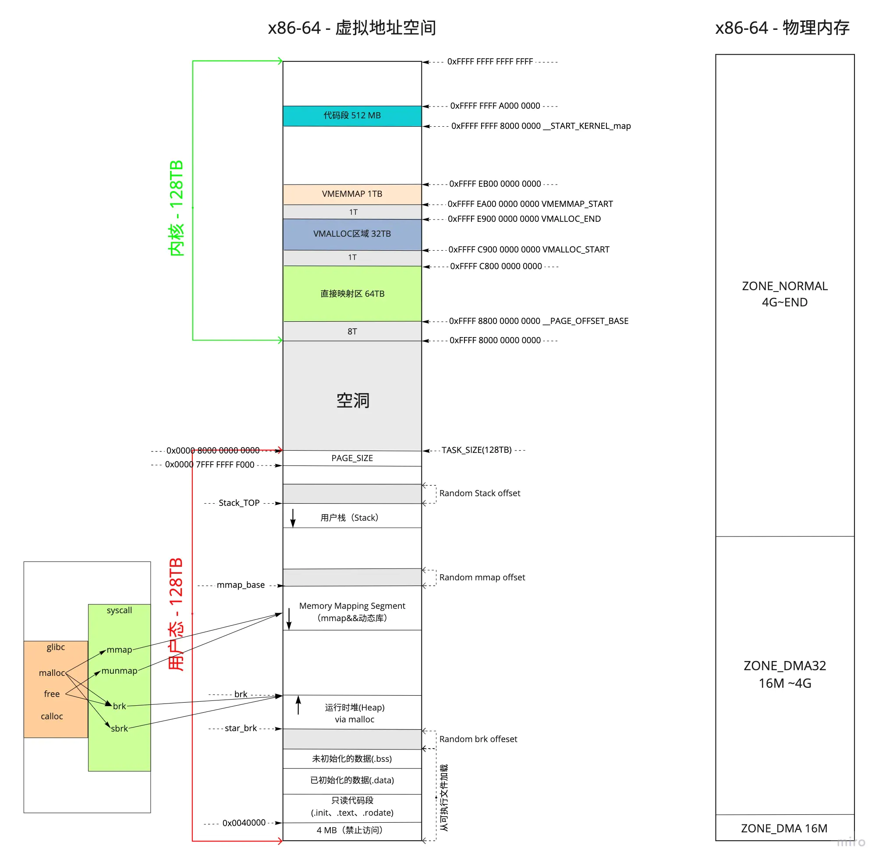
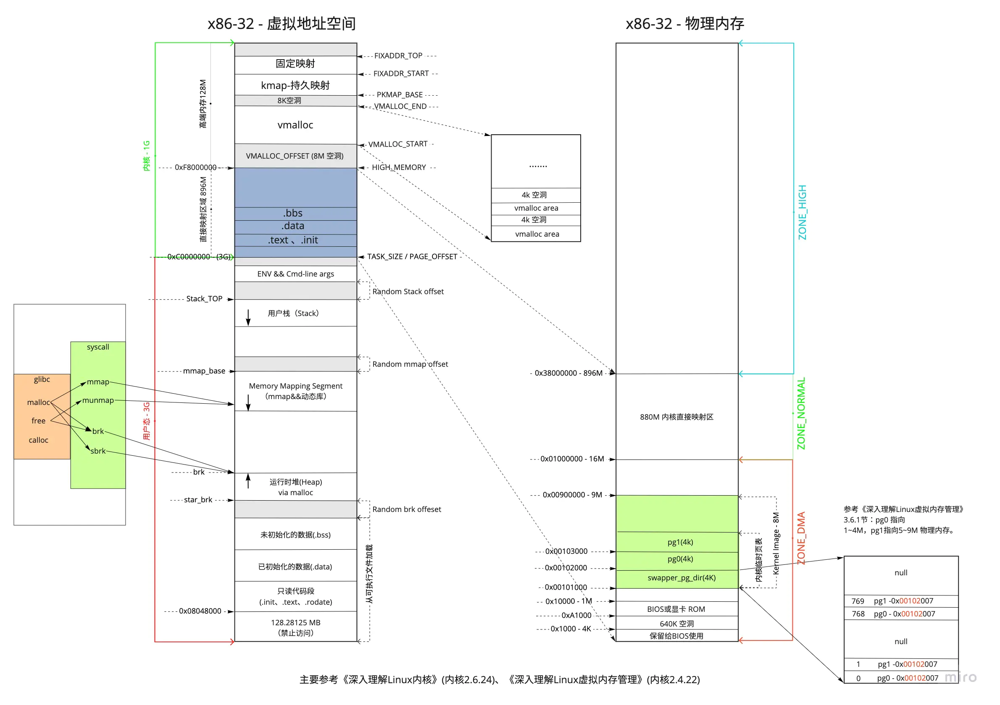
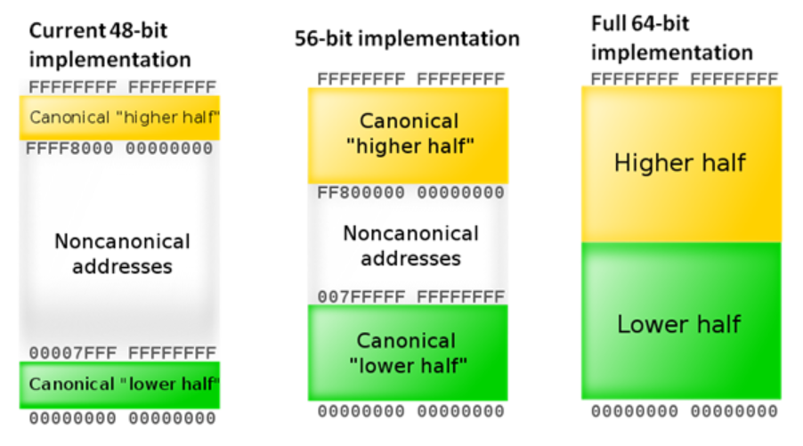
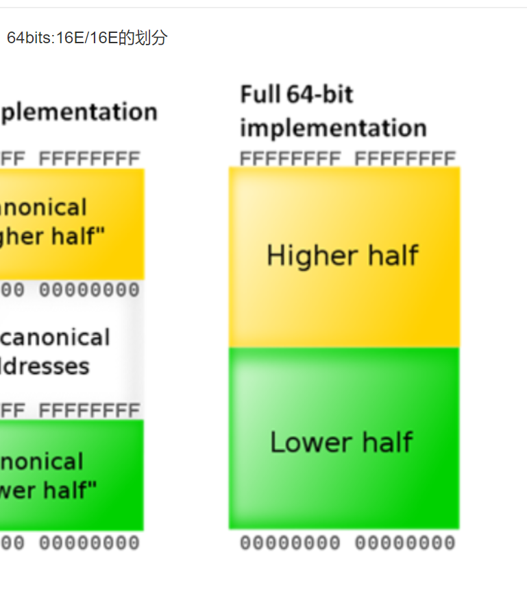
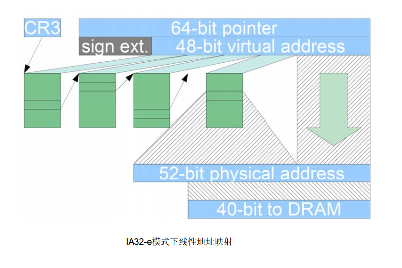
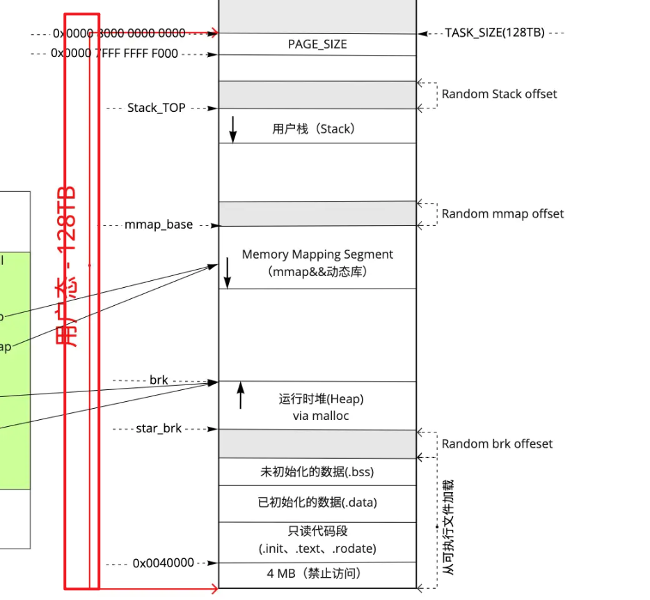
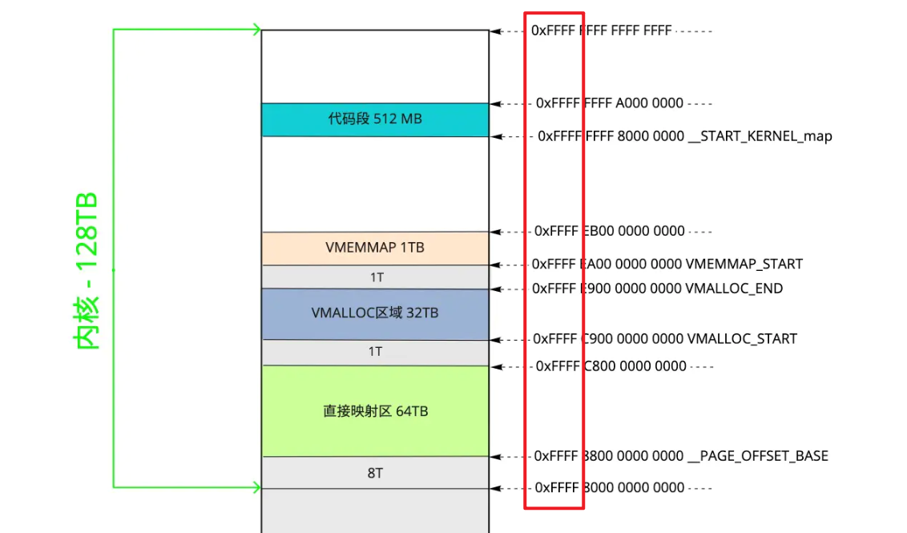
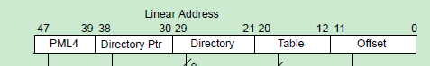

<!-- MDTOC maxdepth:6 firsth1:1 numbering:0 flatten:0 bullets:1 updateOnSave:1 -->

- [x86_64虚拟地址空间布局](#x86_64虚拟地址空间布局)   
   - [64位地址空间可能存在的布局](#64位地址空间可能存在的布局)   
   - [有趣的进制转换问题](#有趣的进制转换问题)   
   - [为何64位系统只用了48位](#为何64位系统只用了48位)   
   - [参考](#参考)   

<!-- /MDTOC -->
# x86_64虚拟地址空间布局

```
========================================================================================================================
    Start addr    |   Offset   |     End addr     |  Size   | VM area description
========================================================================================================================
                  |            |                  |         |
 0000000000000000 |    0       | 00007fffffffffff |  128 TB | user-space virtual memory, different per mm 128T
__________________|____________|__________________|_________|___________________________________________________________
                  |            |                  |         |
 0000800000000000 | +128    TB | ffff7fffffffffff | ~16M TB | ... huge, almost 64 bits wide hole of non-canonical
                  |            |                  |         |     virtual memory addresses up to the -128 TB
                  |            |                  |         |     starting offset of kernel mappings. 空洞区域，高达16M TB
__________________|____________|__________________|_________|___________________________________________________________
                                                            |
                                                            | Kernel-space virtual memory, shared between all processes:
____________________________________________________________|___________________________________________________________
                  |            |                  |         |
 ffff800000000000 | -128    TB | ffff87ffffffffff |    8 TB | ... guard hole, also reserved for hypervisor 128T
 ffff880000000000 | -120    TB | ffff887fffffffff |  0.5 TB | LDT remap for PTI
 ffff888000000000 | -119.5  TB | ffffc87fffffffff |   64 TB | direct mapping of all physical memory (page_offset_base)
 ffffc88000000000 |  -55.5  TB | ffffc8ffffffffff |  0.5 TB | ... unused hole
 ffffc90000000000 |  -55    TB | ffffe8ffffffffff |   32 TB | vmalloc/ioremap space (vmalloc_base)
 ffffe90000000000 |  -23    TB | ffffe9ffffffffff |    1 TB | ... unused hole
 ffffea0000000000 |  -22    TB | ffffeaffffffffff |    1 TB | virtual memory map (vmemmap_base)
 ffffeb0000000000 |  -21    TB | ffffebffffffffff |    1 TB | ... unused hole
 ffffec0000000000 |  -20    TB | fffffbffffffffff |   16 TB | KASAN shadow memory
__________________|____________|__________________|_________|____________________________________________________________
                                                            |
                                                            | Identical layout to the 56-bit one from here on:
____________________________________________________________|____________________________________________________________
                  |            |                  |         |
 fffffc0000000000 |   -4    TB | fffffdffffffffff |    2 TB | ... unused hole
                  |            |                  |         | vaddr_end for KASLR
 fffffe0000000000 |   -2    TB | fffffe7fffffffff |  0.5 TB | cpu_entry_area mapping
 fffffe8000000000 |   -1.5  TB | fffffeffffffffff |  0.5 TB | ... unused hole
 ffffff0000000000 |   -1    TB | ffffff7fffffffff |  0.5 TB | %esp fixup stacks
 ffffff8000000000 | -512    GB | ffffffeeffffffff |  444 GB | ... unused hole
 ffffffef00000000 |  -68    GB | fffffffeffffffff |   64 GB | EFI region mapping space
 ffffffff00000000 |   -4    GB | ffffffff7fffffff |    2 GB | ... unused hole
 ffffffff80000000 |   -2    GB | ffffffff9fffffff |  512 MB | kernel text mapping, mapped to physical address 0
 ffffffff80000000 |-2048    MB |                  |         |
 ffffffffa0000000 |-1536    MB | fffffffffeffffff | 1520 MB | module mapping space
 ffffffffff000000 |  -16    MB |                  |         |
    FIXADDR_START | ~-11    MB | ffffffffff5fffff | ~0.5 MB | kernel-internal fixmap range, variable size and offset
 ffffffffff600000 |  -10    MB | ffffffffff600fff |    4 kB | legacy vsyscall ABI
 ffffffffffe00000 |   -2    MB | ffffffffffffffff |    2 MB | ... unused hole
__________________|____________|__________________|_________|___________________________________________________________
```




* Linux下有效的地址区间是从 0x00000000 00000000 ~ 0x00007FFF FFFFFFFF 还有 0xFFFF8000 00000000 ~ 0xFFFFFFFF FFFFFFFF 两个地址区间。
* 用户地址空间与内核地址空间，每个地址区间都有128TB的地址空间可以使用，所以总共是256TB的可用空间
* 中间空洞多大？~16M TB
* ```sym -l```显示的地址，可以完全对照上述区域，对号入座

区别于x86 32位



## 64位地址空间可能存在的布局

根据内核版本不同,可支持48bit:128T/128T、56bits:64P/64P、64bits:16E/16E的划分




## 有趣的进制转换问题

```
1024 = 0x400
```


```
0000,7fff,ffff,ffff = 140,737,488,355,327 （140737488355327/1024/1024/1024/1024=127）
0000,8000,0000,0000 = 140,737,488,355,328 （140737488355328/1024/1024/1024/1024=128）
```

有没有搞错，少1相差1T？win自带的计算器直接忽略了小数，还不是四舍五入，是直接忽略，所以计算工具得选对

```
127*1024*1024*1024*1024 = 139637976727552
128*1024*1024*1024*1024 = 140737488355328
```

```
[root@centos7-crash ~]# python3
Python 3.6.8 (default, Nov 16 2020, 16:55:22)
[GCC 4.8.5 20150623 (Red Hat 4.8.5-44)] on linux
Type "help", "copyright", "credits" or "license" for more information.
>>> float(140737488355327/1024/1024/1024/1024)
127.99999999999909
```

```
0xFFFF,FFFF,FFFF,FFFF = 18446744073709551615 + 1（0开始） = 18446744073709551616个地址
每个地址一个字节，8bit，则包含 18446744073709551616 Byte = 147573952589676412928 bit

float(18446744073709551616/1024/1024/1024/1024) = 16777216.0 TB 太
float(18446744073709551616/1024/1024/1024/1024/1024) = 16384.0 PB 拍
float(18446744073709551616/1024/1024/1024/1024/1024/1024) = 16.0 EB 艾
```



这图错了伐，应该是8E/8E

```
40 TB
50 PB
60 EB    2^4 = 16 / 2 = 8 EB
```

中间的空洞包含
```
float( int(0xffff7fffffffffff  - 0x0000800000000000 )/1024/1024/1024/1024/1024/1024) = 15.999755859375 = ~16M TB
```

因此实际使用量非常小，剩余空间高达 99.99847412109375%


## 为何64位系统只用了48位

* 每个页面最多包含4096/8 = 512个页面表项.并且2 ^ 9 = 512.所以9*4 + 12 = 48
* 但以内核模块映射区域为例，明显超过48位，```0xfffffffffeffffff```，这是为何？
* 是不是只需要高位都为1就表示内核地址，否则就是用户地址空间？
* 对于用户模式地址，64位中的虚拟地址高16位的地址总被设置为0x0000；对于内核模式地址，总被设置为0xFFFF







*  由于x86_64处理器硬件限制。x86_64处理器地址线只有48条，故而导致硬件要求传入的地址48位到63位地址必须相同。
* 最初AMD规定，只有虚拟地址的最低48位才会在地址转换（页表查询）时被使用。
* 48位地址空间在AMD推出64位时是非常大的，即使对于现在来说也基本够用。48位的虚拟地址转换成物理地址需要4级页表。



* 4K页面下， 48位线性地址分为5段，位宽度分别是9、9、9、12。映射的方法为页表查找。
* 即可管理的地址空间为2^48 = 256T。而在32地址模式下，该值仅为2^32 = 4G。
* 这48位 256T也并没有充分利用，其中用户态内核态分别只用其中128T（本来用户态和内核态可以分别用256T），通过48~63位全1或全0区分内核态、用户态地址空间


## 参考

* <https://www.kernel.org/doc/Documentation/x86/x86_64/mm.txt>

---
