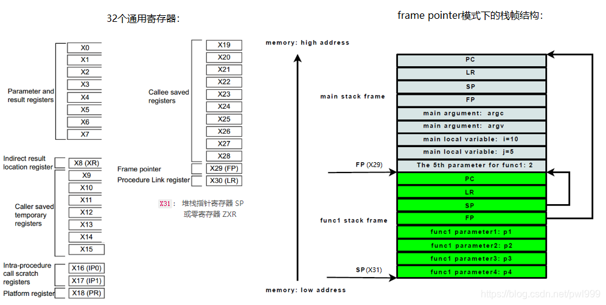

# 栈回溯机制

## 参考/摘抄

(1) 探索Android平台ARM unwind技术 - 知乎 - 知乎专栏. https://zhuanlan.zhihu.com/p/336916116.
(2) linux 栈回溯(x86_64 ) - 知乎 - 知乎专栏. https://zhuanlan.zhihu.com/p/302726082.
(3) (重磅原创)冬之焱: 谈谈Linux内核的栈回溯与妙用 - 腾讯云. https://cloud.tencent.com/developer/article/1518094.
(4) Linux内核系统由哪些部分组成的 - CSDN博客. https://blog.csdn.net/alimingh/article/details/111991788.
(5) Linux内核源码分析(五)--start_kernel之unwind_init - CSDN博客. https://blog.csdn.net/task_struct/article/details/79169042.
(6) undefined. https://github.com/llvm/llvm-project/tree/main/compiler-rt/lib/sanitizer_common.
(7) undefined. https://git.kernel.org/pub/scm/linux/kernel/git/torvalds/linux.git/tree/arch/arm64/kernel?h=v5.10.
(8) undefined. https://git.kernel.org/pub/scm/linux/kernel/git/torvalds/linux.git/tree/arch/arm/kernel/stacktrace.c?h=v5.10.
(9) undefined. https://cs.dartmouth.edu/~sergey/battleaxe/hackito_2011_oakley_bratus.pdf.
(1) linux 栈回溯(x86_64 ) - 知乎 - 知乎专栏. https://zhuanlan.zhihu.com/p/302726082.
(2) Linux内核的栈回溯与妙用 - CSDN博客. https://blog.csdn.net/qq_40732350/article/details/83649888.
(3) linux 进程内核栈 - 知乎. https://zhuanlan.zhihu.com/p/296750228.
(4) linux 进程内核栈 - 知乎. https://zhuanlan.zhihu.com/p/296750228.
(5) Linux内核的栈回溯与妙用 - CSDN博客. https://blog.csdn.net/qq_40732350/article/details/83649888.
(6) 内核栈回溯原理学习应用 - 坚持，每天进步一点点 - 博客园. https://www.cnblogs.com/mysky007/p/12539754.html.
* https://blog.csdn.net/pwl999/article/details/107569603


## 什么是栈回溯 (stack unwind)


栈回溯是一种在程序运行时获取函数调用顺序的方法，它可以帮助调试和分析程序的执行过程和错误原因。

栈回溯的原理是根据函数调用时在栈上保存的返回地址和栈帧信息，逐层向上追踪函数的调用关系，从而重建函数的执行路径。


## 有几种栈回溯


```
unwind是一个英文单词，它的原义是“解开卷绕的东西”，“放松紧张”。在计算机领域，它被用来形容栈回溯的过程，就像把一卷线或绳子从一端开始解开一样。
unwind这个术语最早出现在Lisp语言中，它是一种非本地控制流（non-local control flow）的机制，可以在异常或错误发生时，从当前函数跳转到某个指定的执行点，并在跳转前执行一些清理或恢复的操作。
```

栈回溯有多种实现方式，不同的编译器和操作系统可能有不同的堆栈布局和回溯机制。一般来说，有以下几种主要的栈回溯类型：

- 基于帧指针的栈回溯：
    这种方法是使用一个专门的寄存器（如x86中的ebp或arm64中的x29）来保存每个函数的栈帧地址，然后通过遍历这些地址来回溯栈。这种方法简单高效，但是需要占用一个通用寄存器，并且不支持优化编译选项。
- 基于unwind机制的栈回溯：
    这种方法是在编译时生成一些特殊的调试信息段（如.eh_frame或.arm.exidx），用来描述每个函数的栈帧结构和寄存器状态。然后在运行时通过解析这些信息来回溯栈。这种方法不需要占用通用寄存器，并且支持优化编译选项，但是需要额外的空间和时间开销，并且可能不太可靠。
- 基于符号表或调试信息的栈回溯：
    这种方法是在编译时生成一些包含函数名和地址信息的符号表或调试信息段（如.symtab或.debug_info），用来标识每个函数的起始和结束位置。然后在运行时通过比较当前指令指针和符号表或调试信息中的地址范围来确定当前函数名。这种方法不需要修改堆栈布局，也不需要额外的寄存器，但是需要保留符号表或调试信息，并且可能不太准确或完整。
- 基于内联汇编或伪指令的栈回溯：
    这种方法是在编写汇编代码时使用一些特殊的内联汇编或伪指令（如.cfi_startproc或.cfi_offset），用来生成一些包含函数入栈和出栈信息的元数据，然后在运行时通过解析这些元数据来回溯栈。这种方法可以自定义堆栈布局和寄存器使用，并且可以生成精确和完整的调试信息，但是需要手动编写内联汇编或伪指令，并且可能增加代码复杂度和大小。 

- 基于frame pointer的栈回溯：

这是一种最简单的栈回溯方法，它利用一个专用的寄存器（如x86中的ebp）来保存每个函数调用的栈帧地址，然后通过遍历这些地址来回溯栈。这种方法的优点是方便快捷，缺点是需要占用一个寄存器，并且只能恢复栈指针，而不能恢复其他寄存器。

- 基于.debug_frame或.eh_frame的栈回溯：

这是一种更高级的栈回溯方法，它利用DWARF（Debugging With Attributed Record Formats）标准定义的调试信息节（.debug_frame或.eh_frame）来存储每个函数调用的栈帧信息，包括栈指针和其他寄存器的保存位置和恢复方法。这种方法的优点是不需要占用寄存器，并且可以恢复更多信息，而且没有指令开销。缺点是需要额外的空间来存储调试信息，并且需要解析复杂的DWARF格式。

- 基于CFI directives的栈回溯：
  
这是一种改进.debug_frame或.eh_frame生成的一种方法，它利用GAS（GCC Assembler）汇编编译器定义的一组伪指令（CFI directives）来生成CFI（Call Frame Information）调试信息。这种方法的优点是可以使用高级语言来生成和解析调试信息，而不需要手动编写固定格式的表格。缺点是需要依赖GAS编译器。


CONFIG_UNWINDER_FRAME_POINTER 配置的是基于frame pointer的栈回溯方法。

这种方法是利用一个专用的寄存器（如x86中的ebp）来保存每个函数调用的栈帧地址，然后通过遍历这些地址来回溯栈。这种方法的优点是方便快捷，缺点是需要占用一个寄存器，并且只能恢复栈指针，而不能恢复其他寄存器。


## linux内核(x86_64/aarch64) 的栈回溯

- 基于帧指针的栈回溯：
  
这种方法是使用一个专门的寄存器（如x86中的ebp或arm64中的x29）来保存每个函数的栈帧地址，然后通过遍历这些地址来回溯栈。这种方法简单高效，但是需要占用一个通用寄存器，并且不支持优化编译选项。

- 基于unwind机制的栈回溯：

这种方法是在编译时生成一些特殊的调试信息段（如.eh_frame或.arm.exidx），用来描述每个函数的栈帧结构和寄存器状态。然后在运行时通过解析这些信息来回溯栈。这种方法不需要占用通用寄存器，并且支持优化编译选项，但是需要额外的空间和时间开销，并且可能不太可靠。


1. 通过config判断栈回溯类型

```shell
# CONFIG_UNWINDER_FRAME_POINTER is not set
```

CONFIG_UNWINDER_FRAME_POINTER 没定义，linux必定是栈指针回溯，否则就是unwind回溯

2. 通过calltrace判断栈回溯类型

如果看到类似以下格式的输出，则说明内核使用了基于帧指针的栈回溯：

```
[<ffffffff8100b07c>] dump_stack+0x48/0x68
[<ffffffff810a8f4c>] panic+0xe4/0x21c
[<ffffffff8100f6a4>] die+0x5c/0x70
[<ffffffff81010a14>] do_trap+0xb4/0xc0
[<ffffffff81010d38>] do_invalid_op+0x88/0xa0
[<ffffffff81003f28>] invalid_op+0x14/0x1c
[<ffffffff8107b9e8>] sysrq_handle_crash+0x40/0x50
[<ffffffff8107bd90>] __handle_sysrq+0xd8/0x13c
[<ffffffff8107be10>] write_sysrq_trigger+0x34/0x3c
[<ffffffff8111b9a8>] proc_reg_write+0xa8/0xc4
[<ffffffff8111b900>] proc_reg_write+0x0/0xc4
[<ffffffff8110c9a8>] vfs_write+0xc8/0x1a4
[<ffffffff8110cbf8>] sys_write+0x54/0xa8
[<ffffffff81003c00>] ret_fast_syscall+0x0/0x30
```

如果看到类似以下格式的输出，则说明内核使用了基于unwind机制的栈回溯：

```
Call Trace:
[<c001b5e4>] (unwind_backtrace+0x0/0xf8) from [<c0017a24>] (show_stack+0x10/0x14)
[<c0017a24>] (show_stack+0x10/0x14) from [<c02f6f64>] (dump_stack+0x20/0x28)
[<c02f6f64>] (dump_stack+0x20/0x28) from [<c02f6f9c>] (panic+0x80/0x1d4)
[<c02f6f9c>] (panic+0x80/0x1d4) from [<c00084b4>] (die+0x18c/0x1d8)
[<c00084b4>] (die+0x18c/0x1d8) from [<c00086e4>] (__do_kernel_fault.part.2+0x54/0x60)
[<c00086e4>] (__do_kernel_fault.part.2+0x54/0x60) from [<c001b7a8>] (do_page_fault+0x254/0x274)
[<c001b7a8>] (do_page_fault+0x254/0x274) from [<c00082a8>] (do_DataAbort+0x34/0xa4)
[<c00082a8>] (do_DataAbort+0x34/0xa4) from [<c001b3e4>] (__dabt_svc+0x44/0x60)
Exception stack(0xc04b5fb0 to 0xc04b5ff8)
5fa0:                                     c04b4008 c04b6008 c04b4008 c04b6008
5fc0: c04b4008 c04b6008 c04b4008 c04b6008 c04b4008 c04b6008 c04b4008 c04b6008
5fe0: c04b4008 c04b6008 c04b4008 c04b6008 80000013 ffffffff
```

2. 从/proc/kallsyms判断

/proc/kallsyms文件是一个虚拟文件，它包含了内核中所有符号（包括变量、函数、宏等）及其地址和类型的列表。

可以通过查看/proc/kallsyms文件来判断内核是否包含某些与内核栈回溯相关的符号，例如：

* unwind_frame：这个函数是基于unwind机制实现的内核栈回溯函数，它可以获取当前栈帧的上一个栈帧。
* unwind_stack：这个函数是基于unwind机制实现的内核栈回溯函数，它可以从当前任务或指定任务开始打印出其堆栈跟踪信息。
* dump_stack：这个函数是通用的内核栈回溯函数，它可以打印出当前任务的堆栈跟踪信息，它会根据不同的架构和配置调用不同的内核栈回溯函数。

因此，如果一个内核，/proc/kallsyms 没包含 unwind_frame unwind_stack ，是否说明，这个内核不是unwind方式栈回溯？**不一定**。因为有可能这个内核使用了unwind机制，但是没有导出这些符号，或者使用了其他的符号名。

也有可能这个内核使用了其他的内核栈回溯类型，比如基于帧指针的或者基于符号表的。要确定一个内核使用的是什么内核栈回溯类型，还需要结合其他的方式来判断。


## 附图


