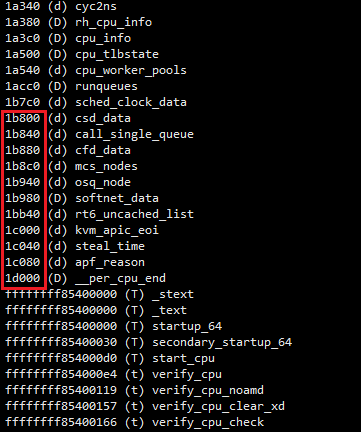

# 获取percpu变量

1. 获取percpu变量符号



看起来像用户空间的低端内存地址，其实都是percpu变量

2. 打印percpu变量

用p打印

```
crash> p cpu_hw_events
PER-CPU DATA TYPE:
  struct cpu_hw_events cpu_hw_events;
PER-CPU ADDRESSES:
  [0]: ffff9a03ffc0e280
  [1]: ffff9a03ffc8e280
  [2]: ffff9a03ffd0e280
  [3]: ffff9a03ffd8e280
crash> sym cpu_hw_events
e280 (D) cpu_hw_events
crash> whatis cpu_hw_events
struct cpu_hw_events cpu_hw_events;
crash>
```


---
