<!-- MDTOC maxdepth:6 firsth1:1 numbering:0 flatten:0 bullets:1 updateOnSave:1 -->

- [获取pfn获取pfn、page和mem_map](#获取pfn获取pfn、page和mem_map)   
   - [如果mem_map符号导出，直接获取即可](#如果mem_map符号导出，直接获取即可)   
   - [更多的情况下，mem_map不导出，怎么获取？](#更多的情况下，mem_map不导出，怎么获取？)   
      - [内存模型](#内存模型)   
   - [三种内存模型在内核配置中的开关](#三种内存模型在内核配置中的开关)   
      - [如何判断当前内核使用什么内存模型?](#如何判断当前内核使用什么内存模型)   
      - [pfn与page转换规则](#pfn与page转换规则)   
   - [获取vmemmap](#获取vmemmap)   
   - [稀疏内存获取pfn](#稀疏内存获取pfn)   
   - [参考](#参考)   

<!-- /MDTOC -->

# 获取pfn获取pfn、page和mem_map


## 如果mem_map符号导出，直接获取即可

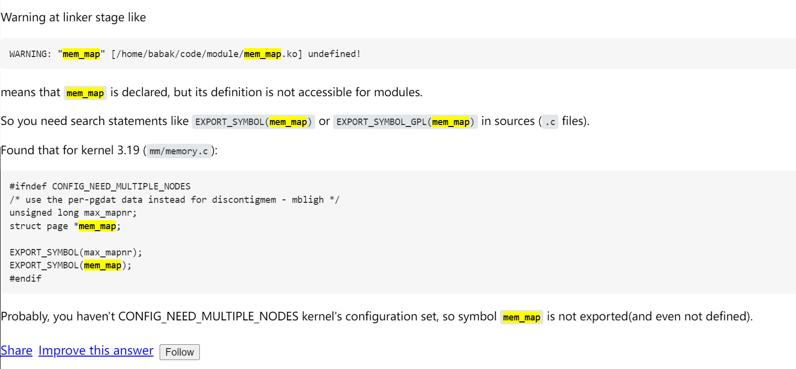


## 更多的情况下，mem_map不导出，怎么获取？


### 内存模型

* Linux目前支持三种内存模型：FLATMEM、DISCONTIGMEM和SPARSEMEM。
* 某些体系架构支持多种内存模型，但在内核编译构建时**只能**选择使用一种内存模型。

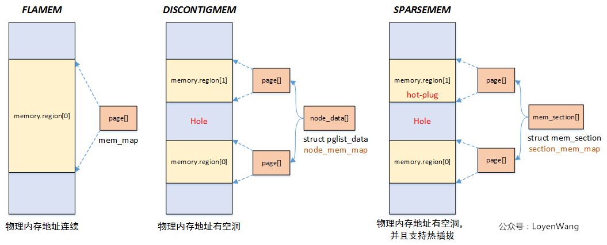


1. 最基本最简单的平坦模型
2. 然后就是有空懂得不连续内存
3. 再者支持热拔插的带空洞的内存模型

```
FLATMEM
  内存连续且不存在空隙
  在大多数情况下，应用于UMA系统「Uniform Memory Access」
DISCONTIGMEM
  多个内存节点不连续并且存在空隙「hole」
  适用于UMA系统和NUMA系统「Non-Uniform Memory Access」
  ARM在2010年已移除了对DISCONTIGMEM内存模型的支持
  ARM: Remove DISCONTIGMEM support
SPARSEMEM
  多个内存区域不连续并且存在空隙
  支持内存热插拔「hot-plug memory」，但性能稍逊色于DISCONTIGMEM
  在x86或ARM64内核采用了最近实现的SPARSEMEM_VMEMMAP变种，其性能比DISCONTIGMEM更优并且与FLATMEM相当
  对于ARM64内核，默认选择SPARSEMEM内存模型
  以section为单位管理online和hot-plug内存
```

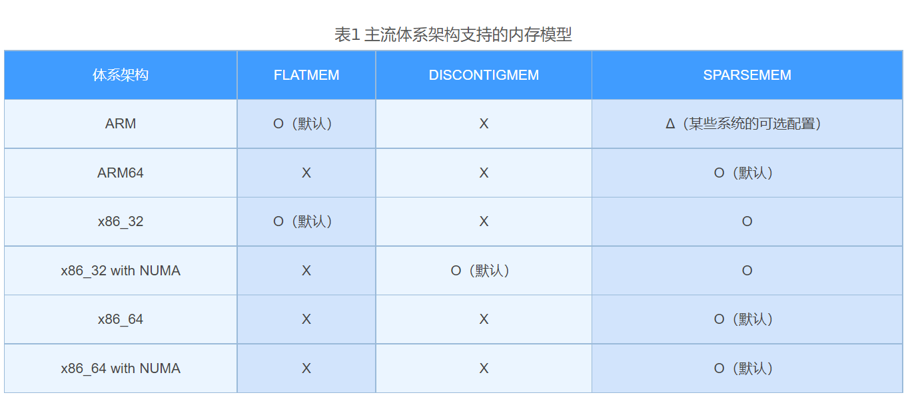

```
一般处理器架构支持一种或者多种内存模型，这个在编译阶段就已经确定，比如目前在ARM64中，使用的Sparse Memory Model。

Flat Memory - 平坦内存模型
物理内存地址连续，这个也是Linux最初使用的内存模型。当内存有空洞的时候也是可以使用这个模型，只是struct page *mem_map数组的大小跟物理地址正相关，内存有空洞会造成浪费。

Discontiguous Memory - 不连续内存模型
物理内存存在空洞，随着Sparse Memory的提出，这种内存模型也逐渐被弃用了。

Sparse Memory - 稀疏内存模型
物理内存存在空洞，并且支持内存热插拔，以section为单位进行管理，这也是下文将分析的。
```

平坦内存模型：

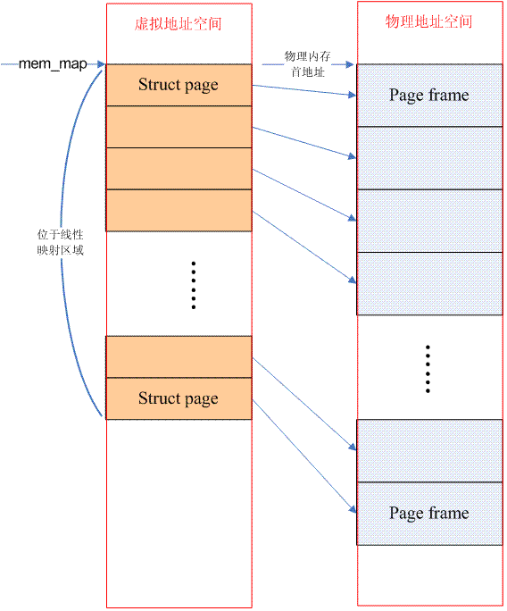

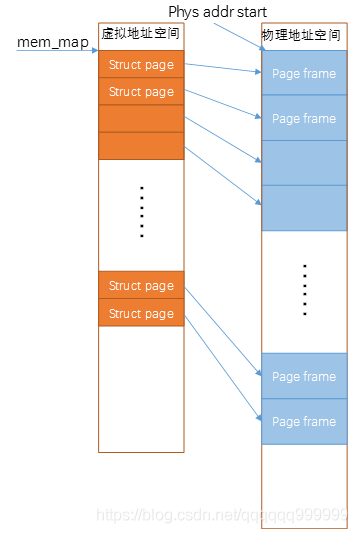

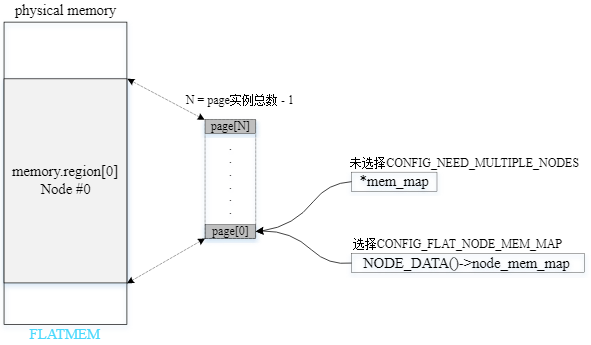

不连续内存模型：


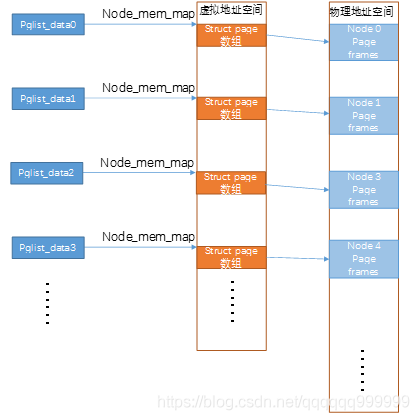

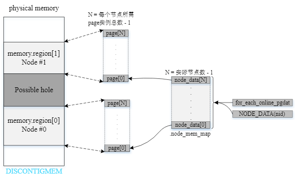

稀疏内存模型：


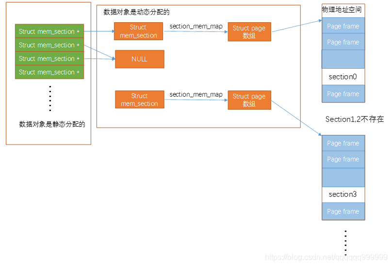

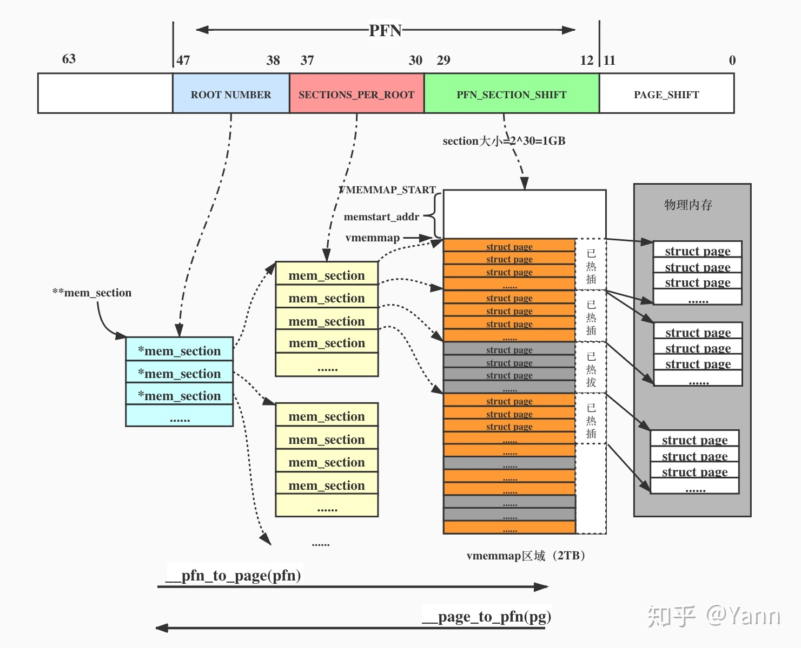

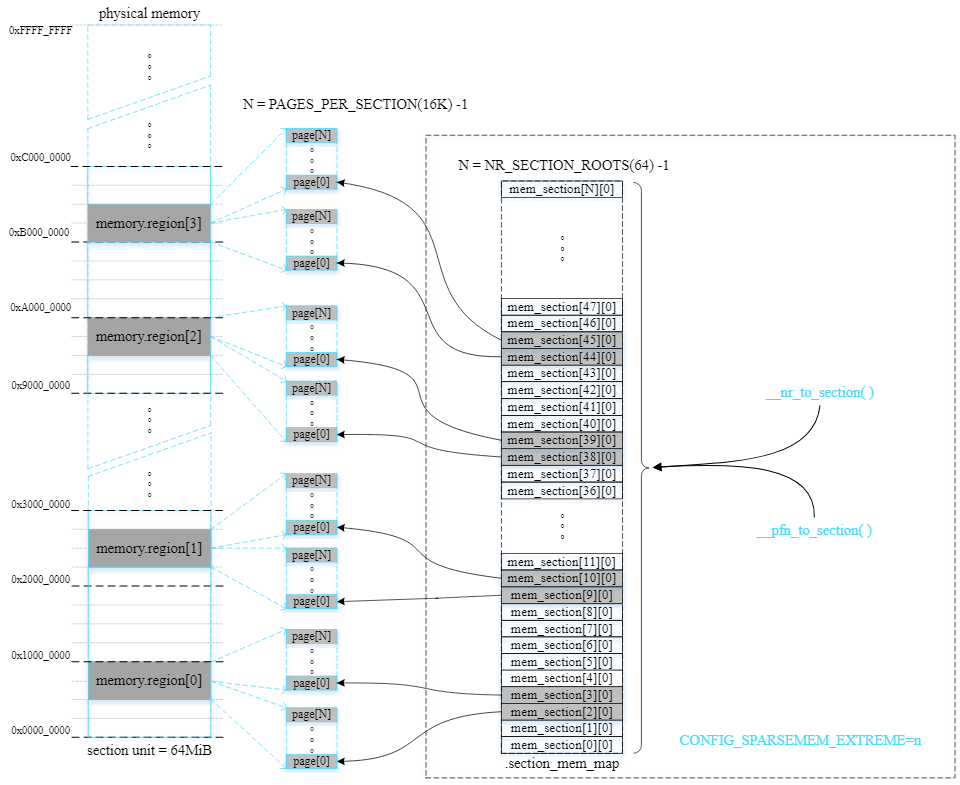

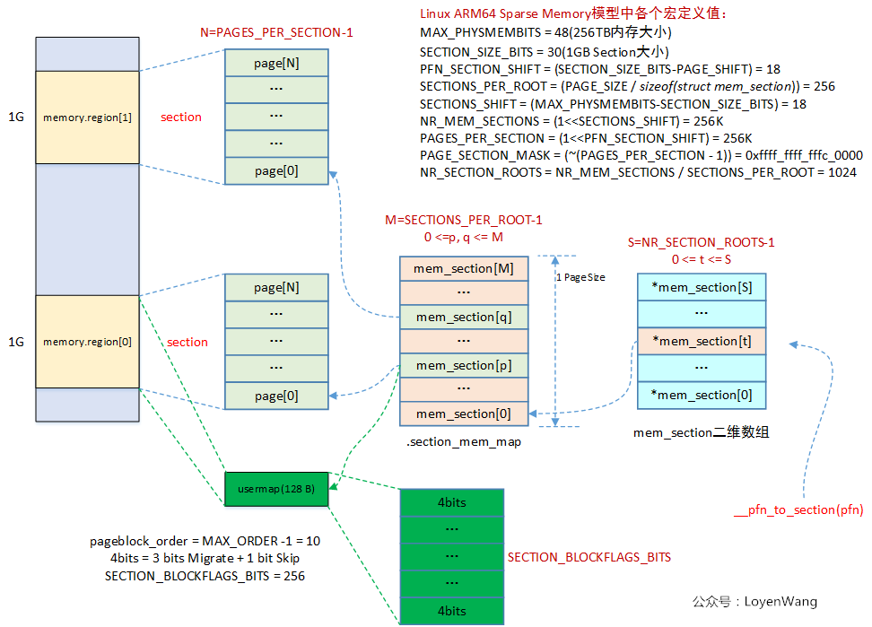

* 整个连续的物理地址空间划分成一个个section，内个section内部，其memory是连续的，因此，mem_map的page数组依附于section结构，而不是node结构了。
* 无论哪一种内存模型，都需要处理PFN与page之间的对应关系，只不过sparse多了一个section的概念，让转换变成了PFN<->section<->page


## 三种内存模型在内核配置中的开关


* 如果在一个体系架构中有多种内存模型可用（ARM64只支持一种内存模型），通过可选的内核配置选项来决定使用哪种内存模型。
* 首先，打开ARCH_SELECT_MEMORY_MODEL和SELECT_MEMORY_MODEL内核配置选项以允许用户能够手动选择内存模型。
* 每种内存模型要求的内核配置选项如图

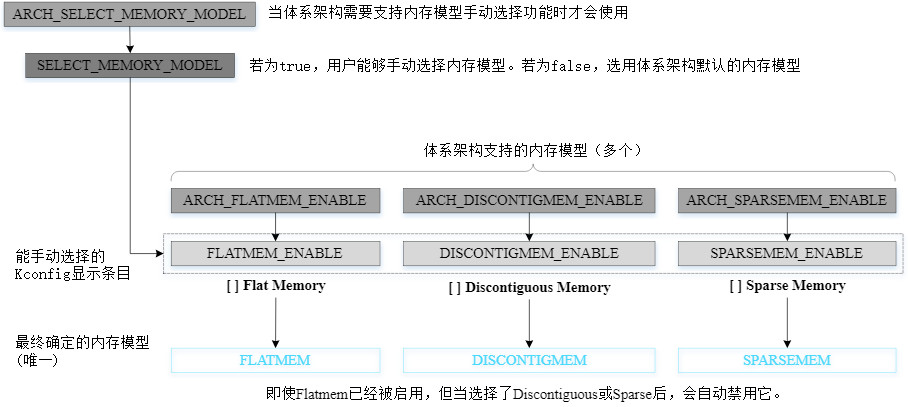


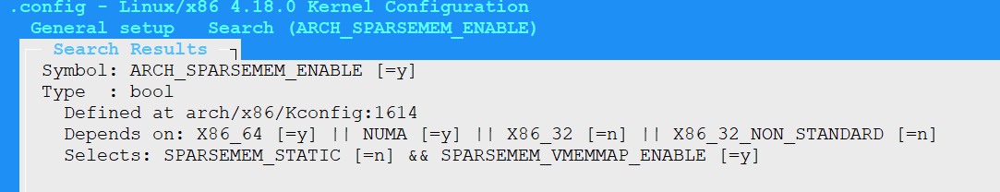


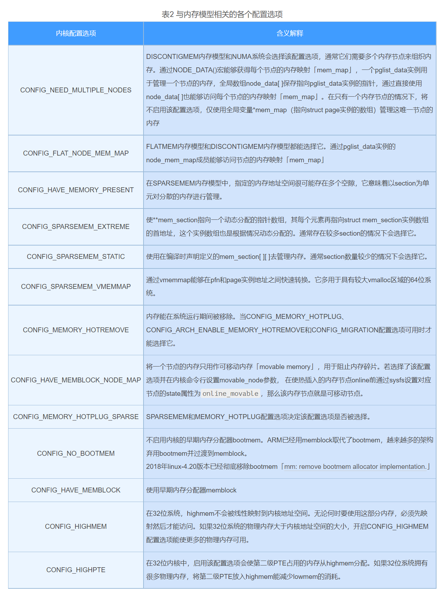


一旦已确定使用的内存模型，还可以设置与内存模型相关的其他配置选项。每种内存模型牵涉的具体配置选项如图所示:


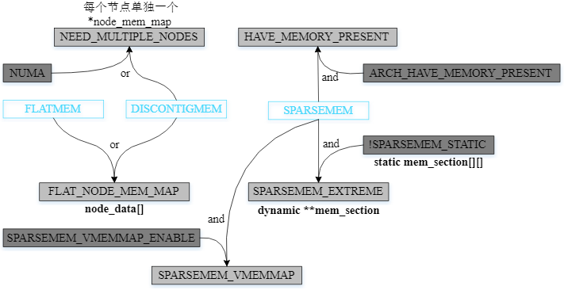


### 如何判断当前内核使用什么内存模型?


* 如果```CONFIG_ARCH_SPARSEMEM_ENABLE=y```则是稀疏模型。

```
[root@centos7-crash ~]# cat /boot/config-3.10.0-1127.el7.x86_64|grep CONFIG_ARCH_SPAR
CONFIG_ARCH_SPARSEMEM_ENABLE=y
CONFIG_ARCH_SPARSEMEM_DEFAULT=y
[root@centos7-crash ~]#
```

```
[root@centos8-crash ~]# cat /boot/config-4.18.0-348.7.3.el8.x86_64|grep CONFIG_ARCH_SPA
CONFIG_ARCH_SPARSEMEM_ENABLE=y
CONFIG_ARCH_SPARSEMEM_DEFAULT=y
[root@centos8-crash ~]#
```

```
[root@X99F8D ~]# cat /boot/config-4.18.0-348.el8.x86_64 |grep CONFIG_ARCH_SP
CONFIG_ARCH_SPARSEMEM_ENABLE=y
CONFIG_ARCH_SPARSEMEM_DEFAULT=y
[root@X99F8D ~]#
```

```
[root@centos8-crash ~]# cat /boot/config-4.18.0-348.7.3.el8.x86_64|grep CONFIG_SPARSEMEM_VMEMMAP
CONFIG_SPARSEMEM_VMEMMAP_ENABLE=y
CONFIG_SPARSEMEM_VMEMMAP=y
```

```
[root@centos7-crash ~]# cat /boot/config-3.10.0-1127.el7.x86_64|grep CONFIG_SPARSEMEM_VMEMMAP
CONFIG_SPARSEMEM_VMEMMAP_ENABLE=y
CONFIG_SPARSEMEM_VMEMMAP=y
```

* 如果```CONFIG_ARCH_DISCONTIGMEM_ENABLE=y```则是稀疏模型
* 如果```CONFIG_ARCH_FLATMEM_ENABLE=y```则是稀疏模型


### pfn与page转换规则

代码分析主要是通过include/asm-generic/memory_model.h展开的。

1. 平坦内存模型

```
#define __pfn_to_page(pfn)    (mem_map + ((pfn) - ARCH_PFN_OFFSET))
#define __page_to_pfn(page)    ((unsigned long)((page) - mem_map) + ARCH_PFN_OFFSET)


#define page_to_pfn(page) ((unsigned long)((page) - mem_map) + PHYS_PFN_OFFSET)
#define pfn_to_page(pfn) (mem_map + ((pfn) - PHYS_PFN_OFFSET))

```

由代码可知，PFN和struct page数组（mem_map）index是线性关系，有一个固定的偏移就是ARCH_PFN_OFFSET，这个偏移是和估计的architecture有关。对于ARM64，定义在arch/arm/include/asm/memory.h文件中，当然，这个定义是和内存所占据的物理地址空间有关（即和PHYS_OFFSET的定义有关）。

2. 不连续内存模型

```
#define __pfn_to_page(pfn)            \
({    unsigned long __pfn = (pfn);        \
    unsigned long __nid = arch_pfn_to_nid(__pfn);  \
    NODE_DATA(__nid)->node_mem_map + arch_local_page_offset(__pfn, __nid);\
})

#define __page_to_pfn(pg)                        \
({    const struct page *__pg = (pg);                    \
    struct pglist_data *__pgdat = NODE_DATA(page_to_nid(__pg));    \
    (unsigned long)(__pg - __pgdat->node_mem_map) +            \
     __pgdat->node_start_pfn;                    \
})
```

Discontiguous Memory Model需要获取node id，只要找到node id，一切都好办了，比对flat memory model进行就OK了。因此对于__pfn_to_page的定义，可以首先通过arch_pfn_to_nid将PFN转换成node id，通过NODE_DATA宏定义可以找到该node对应的pglist_data数据结构，该数据结构的node_start_pfn记录了该node的第一个page frame number，因此，也就可以得到其对应struct page在node_mem_map的偏移。__page_to_pfn类似，大家可以自己分析。

3. 稀疏内存模型


* sparse 模型用来解决内存的热插拔可能导致的内存节点内的 mem_map 不连续的问题。这种模型将连续的地址空间按照 section ( x86_64 NUMA 架构下为 128M )分段，每一个 section 都是 hotplug 的。
* 整个物理内存的地址空间通过指针 struct mem_section * 数组来描述，每个 mem_section * 指向一个 page ， page 中包含若干个 struct mem_section 对象，每个对象描述一个 section 。
* 每一个 section 内部，内存地址都是连续的。因此， mem_map 的 page 数组依赖于 section 结构。
```
#define __page_to_pfn(pg)                   \
({  const struct page *__pg = (pg);             \
    int __sec = page_to_section(__pg);          \
    (unsigned long)(__pg - __section_mem_map_addr(__nr_to_section(__sec))); \
})

#define __pfn_to_page(pfn)              \
({  unsigned long __pfn = (pfn);            \
    struct mem_section *__sec = __pfn_to_section(__pfn);    \
    __section_mem_map_addr(__sec) + __pfn;      \
})
```

如果开启了 CONFIG_SPARSEMEM_VMEMMAP 选项 ( 默认开启 ) ， PFN 和 struct page * 之间的转化十分简单：

```
#define __pfn_to_page(pfn)    (vmemmap + (pfn))
#define __page_to_pfn(page)    (unsigned long)((page) - vmemmap)
```

简单而清晰，PFN就是vmemmap这个struct page数组的index啊。对于ARM64而言，vmemmap定义如下：

```
#define vmemmap  ((struct page *)VMEMMAP_START - \
                 SECTION_ALIGN_DOWN(memstart_addr >> PAGE_SHIFT))
```

毫无疑问，我们需要在虚拟地址空间中分配一段地址来安放struct page数组（该数组包含了所有物理内存跨度空间page），也就是VMEMMAP_START的定义。


## 获取vmemmap

* 如果开启 CONFIG_SPARSEMEM_VMEMMAP ，所有的 struct page * 都保存在连续的地址空间中，起始地址为 VMEMMAP_START ，
* x86架构定义在 arch/x86/include/asm/pgtable_64_types.h ，为 ```0xffffea0000000000```

```
[root@centos8-crash ~/rpmbuild/SOURCES/linux-4.18.0-348.7.3.el8_5/arch/x86/include/asm]# grep -rn ffffea
pgtable_64_types.h:129:#define __VMEMMAP_BASE_L4	0xffffea0000000000UL
```


## 稀疏内存获取pfn

```
crash> sym mem_section
ffffffff82d7e3f8 (B) mem_section
crash> whatis mem_section
struct mem_section **mem_section;
```

```
struct mem_section {
   [0] unsigned long section_mem_map;
       union {
   [8]     struct mem_section_usage *usage;
           struct {
               unsigned long *pageblock_flags;
   [8]     } rh_kabi_hidden_1309;
           union {
               <no data fields>
           };
       };
  [16] struct page_ext *page_ext;
  [24] unsigned long pad;
}
SIZE: 32
```

* 每个mem_section都有一个属于自己的section_mem_map(unsigned long)
* vmemmap的实现和具体的处理器体系有关
* 采用SPARSEMEM的系统可以是NUMA的，也可以是UMA的

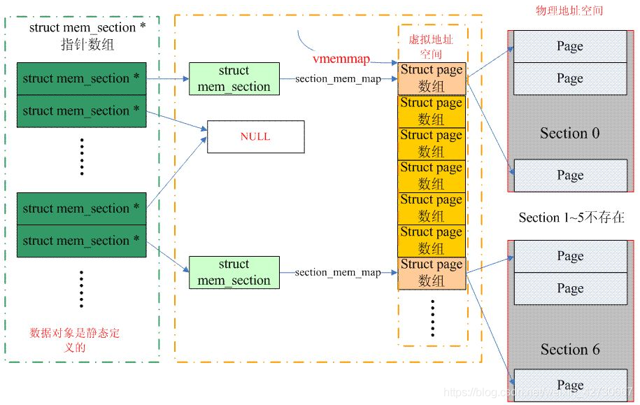


已知 vmemmap = ffffea0000000000,以及目标page，则pfn套公式计算即可

```
#define __pfn_to_page(pfn)    (vmemmap + (pfn))
#define __page_to_pfn(page)    (unsigned long)((page) - vmemmap)
```


## 参考

* <https://stackoverflow.com/questions/31236757/print-virtual-address-of-mem-map-using-a-proc-file>
* <https://www.cnblogs.com/alantu2018/p/8447568.html>
* <https://blog.csdn.net/M120674/article/details/119566365>
* <https://blog.csdn.net/qqqqqq999999/article/details/90547643>
* <https://stackoverflow.com/questions/31236757/print-virtual-address-of-mem-map-using-a-proc-file>
* <https://chasinglulu.github.io/2019/05/29/%E5%86%85%E5%AD%98%E6%A8%A1%E5%9E%8B%E3%80%8Cmemory-model%E3%80%8D/>
* <https://blog.csdn.net/weixin_42730667/article/details/118582882>
* <https://blog.globs.site/post/mm/mm-memsection/>


---
