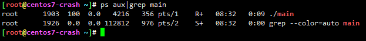
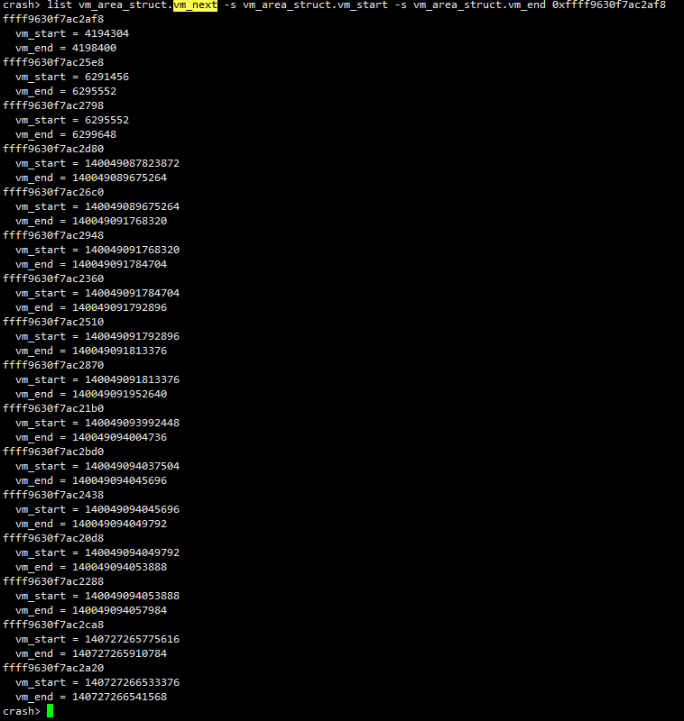
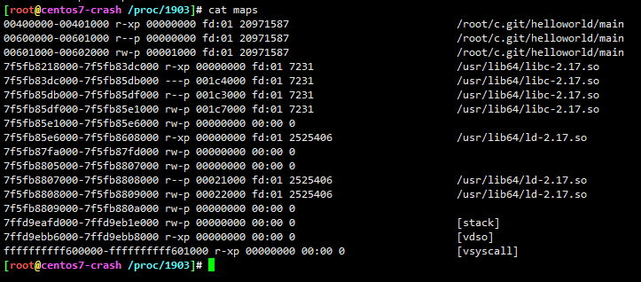

# 获取进程vm_area_struct链表


1. 选定目标pid



2. crash设置当前调试的进程

* set 通过pid设定需要调试的进程
* set 不加参数默认显示当前调试进程信息

```
crash> set 1903
    PID: 1903
COMMAND: "main"
   TASK: ffff9630f269c1c0  [THREAD_INFO: ffff9630f3900000]
    CPU: 3
  STATE: TASK_RUNNING (ACTIVE)
crash> set
    PID: 1903
COMMAND: "main"
   TASK: ffff9630f269c1c0  [THREAD_INFO: ffff9630f3900000]
    CPU: 3
  STATE: TASK_RUNNING (ACTIVE)
crash>
```


3. task命令获取当前进程的task_struct结构体地址

* set可以获取当前进程task_struct地址，当然也可以通过task命令获取

```
crash> task
PID: 1903   TASK: ffff9630f269c1c0  CPU: 3   COMMAND: "main"
struct task_struct {
  state = 0,
  stack = 0xffff9630f3900000,
  usage = {
    counter = 2
  },
  flags = 4202496,
  ptrace = 0,
  wake_entry = {
    next = 0x0
  },
  on_cpu = 1,
  last_wakee = 0xffff962fb3
  ...
```


4. 获取mm结构，task_struct.mm用来管理进程所有关于内存的信息

```
crash> struct task_struct
struct task_struct {
    volatile long state;
    void *stack;
    atomic_t usage;
    unsigned int flags;
    unsigned int ptrace;
    struct llist_node wake_entry;
    int on_cpu;
    struct task_struct *last_wakee;
    unsigned long wakee_flips;
    unsigned long wakee_flip_decay_ts;
  ...
    struct mm_struct *mm;
  ...
    struct task_group *sched_task_group;
    struct hlist_head preempt_notifiers;
    unsigned char fpu_counter;
crash> struct task_struct.mm -o
struct task_struct {
  [1128] struct mm_struct *mm;
}

```

* 先通过struct task_struct获取task_struct的定义，找到mm元素
* 如果你知道你要找的就是mm，那么可以更简单


5. 获取mm_struct结构体的地址

```
crash> task -R mm
PID: 1903   TASK: ffff9630f269c1c0  CPU: 3   COMMAND: "main"
  mm = 0xffff9630f2733840,
```


```
crash> struct task_struct.mm ffff9630f269c1c0
  mm = 0xffff9630f2733840
```

```
crash>  rd -x 0xffff9630f2733840
ffff9630f2733840:  ffff9630f7ac2af8
```


6. mm元素是task_struct中的变量名称，那么它是什么类型？

```
crash> whatis task_struct.mm
struct task_struct {
  [1128] struct mm_struct *mm;
}
```

当然也可以通过struct task_struct 去检索

```
crash> struct task_struct.mm
struct task_struct {
  [1128] struct mm_struct *mm;
}
```

mm = 0xffff9630f2733840

```
crash>  rd -x 0xffff9630f2733840
ffff9630f2733840:  ffff9630f7ac2af8
```


7. 获取mm_struct定义

```
crash> struct mm_struct
struct mm_struct {
    struct vm_area_struct *mmap;
    struct rb_root mm_rb;
  ...
```

毫无疑问，当前所需是mmap


8. 获取vm_area_struct

```
struct vm_area_struct {
    unsigned long vm_start;
    unsigned long vm_end;
    struct vm_area_struct *vm_next;
    struct vm_area_struct *vm_prev;
    struct rb_node vm_rb;
...
```


9. 获取第一个vm_area_struct记录mmap

```
crash> struct mm_struct 0xffff9630f2733840
struct mm_struct {
  mmap = 0xffff9630f7ac2af8,
  mm_rb = {
    rb_node = 0xffff9630f7ac2bf0
  },

```


```
crash> list vm_area_struct.vm_next 0xffff9630f7ac2af8
ffff9630f7ac2af8
ffff9630f7ac25e8
ffff9630f7ac2798
ffff9630f7ac2d80
ffff9630f7ac26c0
ffff9630f7ac2948
ffff9630f7ac2360
ffff9630f7ac2510
ffff9630f7ac2870
ffff9630f7ac21b0
ffff9630f7ac2bd0
ffff9630f7ac2438
ffff9630f7ac20d8
ffff9630f7ac2288
ffff9630f7ac2ca8
ffff9630f7ac2a20
```


```
crash> list vm_area_struct.vm_next -s vm_area_struct.vm_start -s vm_area_struct.vm_end 0xffff9630f7ac2af8
ffff9630f7ac2af8
  vm_start = 4194304  # 40 0000
  vm_end = 4198400   # 40 1000
ffff9630f7ac25e8
  vm_start = 6291456
  vm_end = 6295552
ffff9630f7ac2798
  vm_start = 6295552
  vm_end = 6299648
ffff9630f7ac2d80
  vm_start = 140049087823872
  vm_end = 140049089675264
ffff9630f7ac26c0
  vm_start = 140049089675264
  vm_end = 140049091768320
ffff9630f7ac2948
  vm_start = 140049091768320
  vm_end = 140049091784704
ffff9630f7ac2360
  vm_start = 140049091784704
  vm_end = 140049091792896
ffff9630f7ac2510
  vm_start = 140049091792896
  vm_end = 140049091813376
ffff9630f7ac2870
  vm_start = 140049091813376
  vm_end = 140049091952640
ffff9630f7ac21b0
  vm_start = 140049093992448
  vm_end = 140049094004736
ffff9630f7ac2bd0
  vm_start = 140049094037504
  vm_end = 140049094045696
ffff9630f7ac2438
  vm_start = 140049094045696
  vm_end = 140049094049792
ffff9630f7ac20d8
  vm_start = 140049094049792
  vm_end = 140049094053888
ffff9630f7ac2288
  vm_start = 140049094053888
  vm_end = 140049094057984
ffff9630f7ac2ca8
  vm_start = 140727265775616
  vm_end = 140727265910784
ffff9630f7ac2a20
  vm_start = 140727266533376 # 7FFD 9EBB 6000
  vm_end = 140727266541568  # 7FFD 9EBB 8000

```






不包含vsyscall

```
ffffffffff600000-ffffffffff601000 r-xp 00000000 00:00 0                  [vsyscall]
```

* vsyscall和vDSO是用于加速某些系统调用的两种机制。
* 传统的int 0x80有点慢, Intel和AMD分别实现了sysenter/sysexit和syscall/ sysret, 即所谓的快速系统调用指令, 使用它们更快, 但是也带来了兼容性的问题


## 嵌套关系


```
struct task_struct
  -> struct mm_struct *mm;
    -> struct vm_area_struct *mmap;
      -> struct vm_area_struct *next;
```


---
