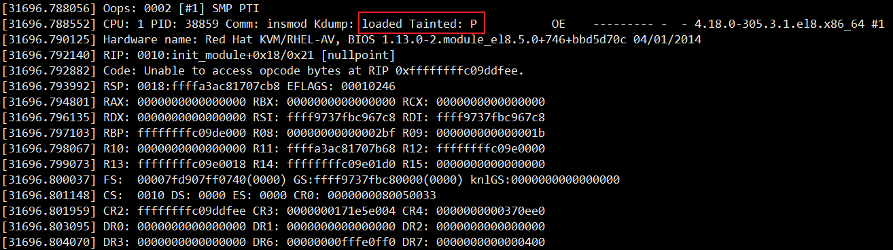

# crash潜规则

## loaded Tainted含义




```
The Tainted flag points to P here.
Each flag has its own meaning.
 A few other flags, and their meanings, picked up from kernel/panic.c:

P — Proprietary module has been loaded.
F — Module has been forcibly loaded.
S — SMP with a CPU not designed for SMP.
R — User forced a module unload.
M — System experienced a machine check exception.
B — System has hit bad_page.
U — Userspace-defined naughtiness.
A — ACPI table overridden.
W — Taint on warning.
```


---
