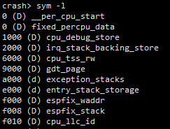
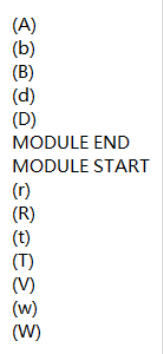

# ELF符号


## 内核ELF中的符号类型

sym可以列出所有符号，导出所有符号




```
crash > sym -l > log.sym
```

```
awk '{print $2}' log.sym | sort | uniq > log.type
```

内核ELF符号包括以下类型，各个类型什么区别，什么意思？



## ELF类型定义

* <https://linux.die.net/man/1/nm>

```
If lowercase, the symbol is local; if uppercase, the symbol is global (external).
```

如果是小写，则为局部，否则为全局导出

```
"A"
The symbol's value is absolute, and will not be changed by further linking.

"B" "b"

The symbol is in the uninitialized data section (known as BSS ).

"D" "d"

The symbol is in the initialized data section.

"R" "r"

The symbol is in a read only data section.

"T" "t"

The symbol is in the text (code) section.

"V" "v"

The symbol is a weak object. When a weak defined symbol is linked with a normal defined symbol, the normal defined symbol is used with no error. When a weak undefined symbol is linked and the symbol is not defined, the value of the weak symbol becomes zero with no error. On some systems, uppercase indicates that a default value has been specified.

"W" "w"

The symbol is a weak symbol that has not been specifically tagged as a weak object symbol. When a weak defined symbol is linked with a normal defined symbol, the normal defined symbol is used with no error. When a weak undefined symbol is linked and the symbol is not defined, the value of the symbol is determined in a system-specific manner without error. On some systems, uppercase indicates that a default value has been specified.
```

* 当然还包括其他，当前只列出内核ELF中包含的类型
* nm工具列出所有符号 - list symbols from object files


## 参考

* <https://www.intezer.com/blog/malware-analysis/executable-linkable-format-101-part-2-symbols/>


---
