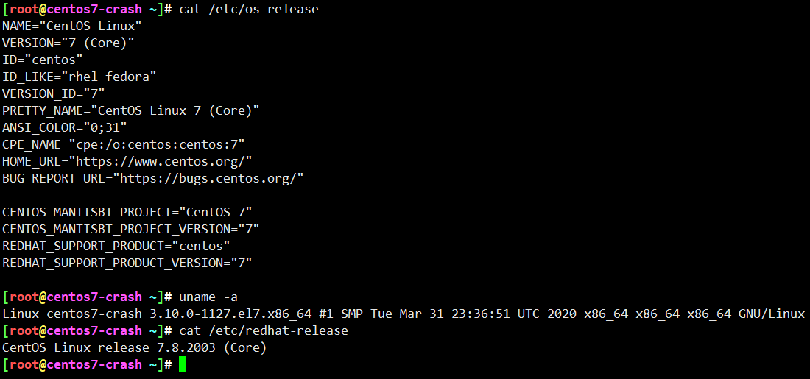
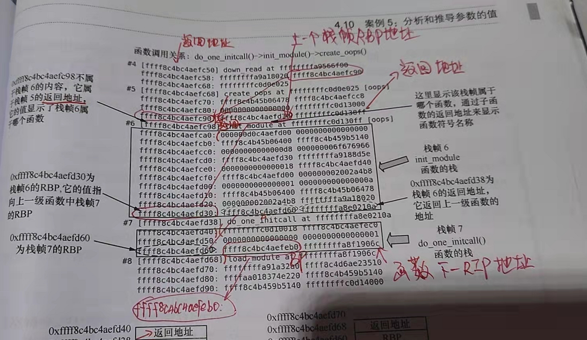
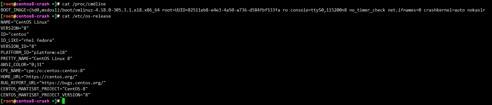
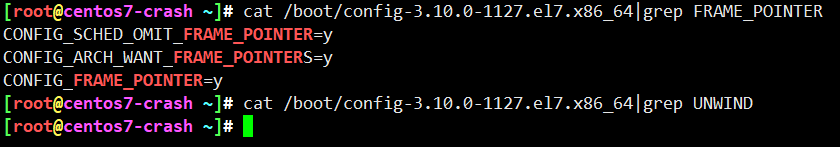
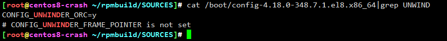
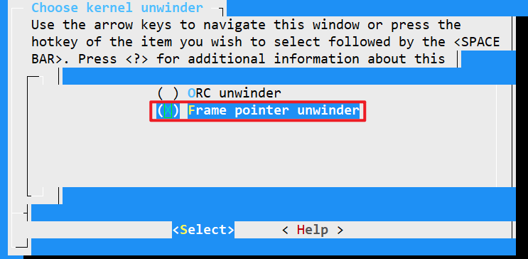
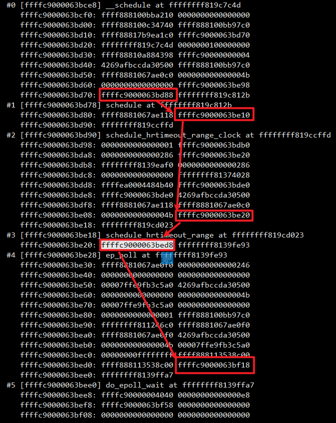
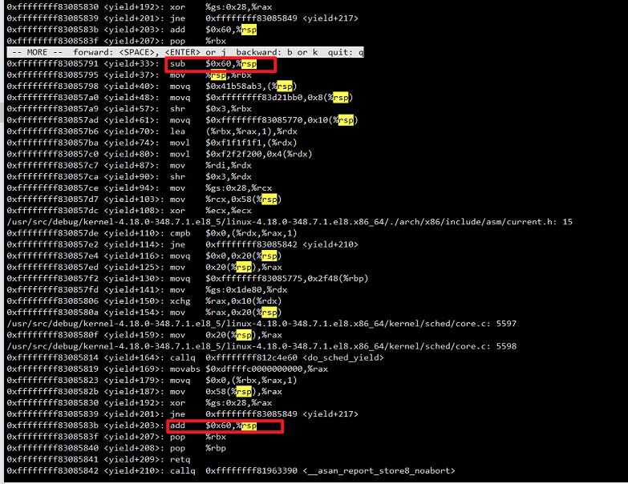

<!-- MDTOC maxdepth:6 firsth1:1 numbering:0 flatten:0 bullets:1 updateOnSave:1 -->

- [no-omit-frame-pointer编译标识](#no-omit-frame-pointer编译标识)   
   - [无法通过rbp获取栈帧](#无法通过rbp获取栈帧)   
   - [CONFIG_UNWINDER_FRAME_POINTER](#config_unwinder_frame_pointer)   
   - [总结](#总结)   

<!-- /MDTOC -->
# no-omit-frame-pointer编译标识

## 无法通过rbp获取栈帧





CentOS 7 crash bt -f栈帧符合笨叔书中描述

但 CentOS 8 不符合，为什么？



神仙指导，一语中的。来了解一下Unwind栈回溯


* <https://blog.csdn.net/pwl999/article/details/107569603?utm_source=app&app_version=5.2.0>


## CONFIG_UNWINDER_FRAME_POINTER

```
Documentation/admin-guide/kdump/gdbmacros.txt:55:	dump all thread stack traces on a kernel compiled with !CONFIG_FRAME_POINTER
Documentation/admin-guide/kdump/gdbmacros.txt:101:	dump all thread stack traces on a kernel compiled with CONFIG_FRAME_POINTER
Documentation/dev-tools/gdb-kernel-debugging.rst:32:  CONFIG_FRAME_POINTER, keep it enabled.
Documentation/dev-tools/kgdb.rst:64:``CONFIG_FRAME_POINTER`` kernel option which is called :menuselection:`Compile
Documentation/dev-tools/kgdb.rst:89:  CONFIG_FRAME_POINTER=y
Documentation/dev-tools/kgdb.rst:118:  CONFIG_FRAME_POINTER=y
Makefile:743:ifdef CONFIG_FRAME_POINTER
arch/arc/include/asm/unwind.h:63:#ifdef CONFIG_FRAME_POINTER
arch/arc/kernel/unwind.c:1096:#ifdef CONFIG_FRAME_POINTER
arch/arm/Makefile:41:ifeq ($(CONFIG_FRAME_POINTER),y)
arch/arm/include/asm/cacheflush.h:458: *   CONFIG_FRAME_POINTER=y.  ip is saved as well if ever r12-clobbering
arch/arm/include/asm/ftrace.h:40:#if defined(CONFIG_FRAME_POINTER) && !defined(CONFIG_ARM_UNWIND)
arch/arm/include/asm/ftrace.h:43: * CONFIG_FRAME_POINTER=y and CONFIG_ARM_UNWIND=y walk_stackframe uses unwind
arch/arm/kernel/entry-ftrace.S:56:#error Ftrace requires CONFIG_FRAME_POINTER=y with GCC older than 4.4.0.
arch/arm/kernel/entry-header.S:36:#ifdef CONFIG_FRAME_POINTER
arch/arm/kernel/return_address.c:14:#if defined(CONFIG_FRAME_POINTER) && !defined(CONFIG_ARM_UNWIND)
arch/arm/kernel/return_address.c:59:#endif /* if defined(CONFIG_FRAME_POINTER) && !defined(CONFIG_ARM_UNWIND) */
arch/arm/kernel/stacktrace.c:10:#if defined(CONFIG_FRAME_POINTER) && !defined(CONFIG_ARM_UNWIND)
arch/arm/lib/backtrace.S:28:#if !defined(CONFIG_FRAME_POINTER) || !defined(CONFIG_PRINTK)
arch/arm/net/bpf_jit_32.c:1121:#ifdef CONFIG_FRAME_POINTER
arch/arm/net/bpf_jit_32.c:1157:#ifdef CONFIG_FRAME_POINTER
arch/arm64/kernel/entry-ftrace.S:28: * (or CONFIG_FRAME_POINTER, this is forced on arm64)
arch/microblaze/kernel/unwind.c:34: * At this writing (3/2010), Microblaze does not support CONFIG_FRAME_POINTERS,
arch/nds32/kernel/process.c:191:	if (IS_ENABLED(CONFIG_FRAME_POINTER)) {
arch/nds32/kernel/traps.c:125:	if (!IS_ENABLED(CONFIG_FRAME_POINTER)) {
arch/nds32/kernel/traps.c:165:	if (!IS_ENABLED(CONFIG_FRAME_POINTER)) {
arch/openrisc/kernel/unwinder.c:18:#ifdef CONFIG_FRAME_POINTER
arch/openrisc/kernel/unwinder.c:87:#else /* CONFIG_FRAME_POINTER */
arch/openrisc/kernel/unwinder.c:104:#endif /* CONFIG_FRAME_POINTER */
arch/riscv/include/asm/ftrace.h:5: * The graph frame test is not possible if CONFIG_FRAME_POINTER is not enabled.
arch/riscv/include/asm/ftrace.h:8:#if defined(CONFIG_FUNCTION_GRAPH_TRACER) && defined(CONFIG_FRAME_POINTER)
arch/riscv/kernel/stacktrace.c:23:#ifdef CONFIG_FRAME_POINTER
arch/riscv/kernel/stacktrace.c:76:#else /* !CONFIG_FRAME_POINTER */
arch/riscv/kernel/stacktrace.c:108:#endif /* CONFIG_FRAME_POINTER */
arch/s390/Makefile:69:cflags-$(CONFIG_FRAME_POINTER) += -fno-optimize-sibling-calls
arch/sh/configs/cayman_defconfig:66:CONFIG_FRAME_POINTER=y
arch/sh/configs/magicpanelr2_defconfig:91:CONFIG_FRAME_POINTER=y
arch/sh/configs/rsk7203_defconfig:124:CONFIG_FRAME_POINTER=y
arch/sh/configs/se7206_defconfig:104:CONFIG_FRAME_POINTER=y
arch/sh/configs/se7712_defconfig:100:CONFIG_FRAME_POINTER=y
arch/sh/configs/se7721_defconfig:128:CONFIG_FRAME_POINTER=y
arch/sh/configs/sh2007_defconfig:167:CONFIG_FRAME_POINTER=y
arch/sh/configs/shx3_defconfig:101:CONFIG_FRAME_POINTER=y
arch/sh/configs/urquell_defconfig:145:CONFIG_FRAME_POINTER=y
arch/sh/kernel/process_32.c:223:#ifdef CONFIG_FRAME_POINTER
arch/sh/kernel/process_64.c:424:#ifdef CONFIG_FRAME_POINTER
arch/sh/kernel/process_64.c:447:#ifdef CONFIG_FRAME_POINTER
arch/um/include/asm/stacktrace.h:17:#ifdef CONFIG_FRAME_POINTER
arch/unicore32/Makefile:29:ifeq ($(CONFIG_FRAME_POINTER),y)
arch/unicore32/configs/unicore32_defconfig:212:CONFIG_FRAME_POINTER=y
arch/unicore32/include/asm/stacktrace.h:23:#ifdef CONFIG_FRAME_POINTER
arch/unicore32/kernel/entry.S:39:#ifdef CONFIG_FRAME_POINTER
arch/unicore32/kernel/stacktrace.c:19:#if defined(CONFIG_FRAME_POINTER)
arch/unicore32/lib/backtrace.S:28:#if !defined(CONFIG_FRAME_POINTER) || !defined(CONFIG_PRINTK)
arch/x86/configs/x86_64_defconfig:307:CONFIG_FRAME_POINTER=y
arch/x86/include/asm/frame.h:12:#ifdef CONFIG_FRAME_POINTER
arch/x86/include/asm/frame.h:75:#else /* !CONFIG_FRAME_POINTER */
arch/x86/include/asm/frame.h:92:#endif /* CONFIG_FRAME_POINTER */
arch/x86/include/asm/stacktrace.h:59:#ifdef CONFIG_FRAME_POINTER
arch/x86/include/asm/stacktrace.h:77:#endif /* CONFIG_FRAME_POINTER */
arch/x86/include/asm/thread_info.h:194:#if defined(CONFIG_FRAME_POINTER)
arch/x86/kernel/Makefile:41:ifdef CONFIG_FRAME_POINTER
arch/x86/kernel/ftrace_32.S:18:#ifdef CONFIG_FRAME_POINTER
arch/x86/kernel/ftrace_32.S:30:#ifdef CONFIG_FRAME_POINTER
arch/x86/kernel/ftrace_32.S:51:#ifdef CONFIG_FRAME_POINTER
arch/x86/kernel/ftrace_32.S:74:#ifdef CONFIG_FRAME_POINTER
arch/x86/kernel/ftrace_64.S:20:#ifdef CONFIG_FRAME_POINTER
arch/x86/kernel/ftrace_64.S:26:#endif /* CONFIG_FRAME_POINTER */
arch/x86/kernel/ftrace_64.S:58:#ifdef CONFIG_FRAME_POINTER
arch/x86/kernel/ftrace_64.S:78:#endif /* CONFIG_FRAME_POINTER */
arch/x86/kernel/ftrace_64.S:96:#ifdef CONFIG_FRAME_POINTER
arch/x86/kernel/stacktrace.c:62:			if (IS_ENABLED(CONFIG_FRAME_POINTER))
arch/x86/kernel/time.c:37:#ifdef CONFIG_FRAME_POINTER
arch/x86/kvm/Makefile:6:ifeq ($(CONFIG_FRAME_POINTER),y)
arch/xtensa/configs/common_defconfig:52:# CONFIG_FRAME_POINTER is not set
arch/xtensa/configs/iss_defconfig:32:# CONFIG_FRAME_POINTER is not set
arch/xtensa/configs/nommu_kc705_defconfig:112:# CONFIG_FRAME_POINTER is not set
arch/xtensa/include/asm/ftrace.h:23:#ifdef CONFIG_FRAME_POINTER
arch/xtensa/kernel/stacktrace.c:235:#ifdef CONFIG_FRAME_POINTER
include/linux/ftrace.h:753:# ifdef CONFIG_FRAME_POINTER
lib/Kconfig.debug:417:	  pointers (if CONFIG_FRAME_POINTER is enabled).  This helps ensure
lib/Kconfig.kgdb:13:	  CONFIG_FRAME_POINTER to aid in producing more reliable stack
scripts/Makefile.build:254:ifndef CONFIG_FRAME_POINTER
tools/lib/bpf/bpf_tracing.h:140:/* Works only with CONFIG_FRAME_POINTER */
tools/lib/bpf/bpf_tracing.h:165:#define PT_REGS_FP(x) ((x)->uregs[11]) /* Works only with CONFIG_FRAME_POINTER */
tools/lib/bpf/bpf_tracing.h:192:/* Works only with CONFIG_FRAME_POINTER */
tools/lib/bpf/bpf_tracing.h:217:#define PT_REGS_FP(x) ((x)->regs[30]) /* Works only with CONFIG_FRAME_POINTER */
tools/objtool/Documentation/stack-validation.txt:41:   CONFIG_FRAME_POINTER.  For some other architectures they may be
tools/objtool/Documentation/stack-validation.txt:49:   CONFIG_FRAME_POINTER is honored for C code but not for most asm code.
tools/objtool/Documentation/stack-validation.txt:89:   functions honor CONFIG_FRAME_POINTER, no functions will ever[*] be
tools/objtool/Documentation/stack-validation.txt:138:   correct frame pointer logic, if required by CONFIG_FRAME_POINTER or
tools/objtool/Documentation/stack-validation.txt:186:   updating the frame pointer, and CONFIG_FRAME_POINTER is enabled.
tools/objtool/Documentation/stack-validation.txt:261:   Make sure that, when CONFIG_FRAME_POINTER is enabled, the function
.config:7209:CONFIG_FRAME_POINTER=y
```

## 总结


1. 配置 CONFIG_UNWINDER_ORC  和  CONFIG_UNWINDER_FRAME_POINTER 这两个只能选其一
2. CentOS8 默认用了 CONFIG_UNWINDER_ORC，该配置会禁用CONFIG_FRAME_POINTER
（我测试直接加CONFIG_FRAME_POINTER，在配置校验时会自动删掉，加不上，就是因为与CONFIG_UNWINDER_ORC冲突）。
除非选择CONFIG_UNWINDER_FRAME_POINTER，就会自动打开CONFIG_FRAME_POINTER
3. CentOS7没有  CONFIG_UNWINDER_FRAME_POINTER 和  CONFIG_UNWINDER_ORC，但默认包含CONFIG_FRAME_POINTER
4. 关键是CONFIG_FRAME_POINTER配置项













---
