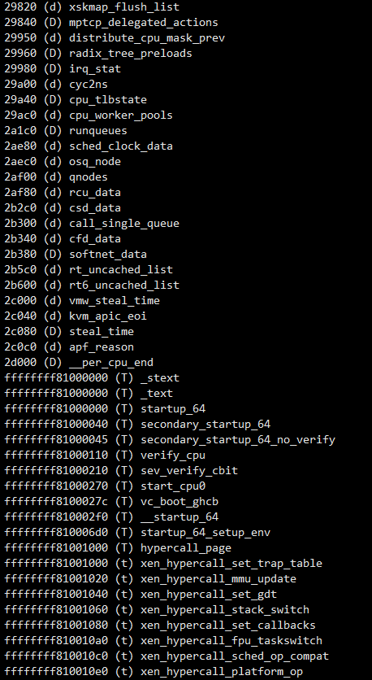
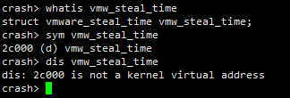
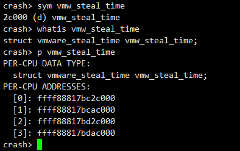
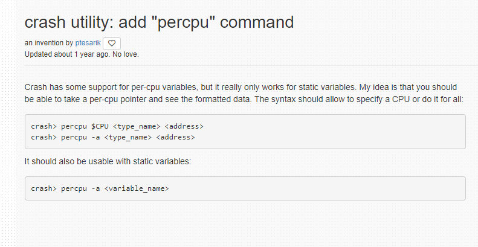
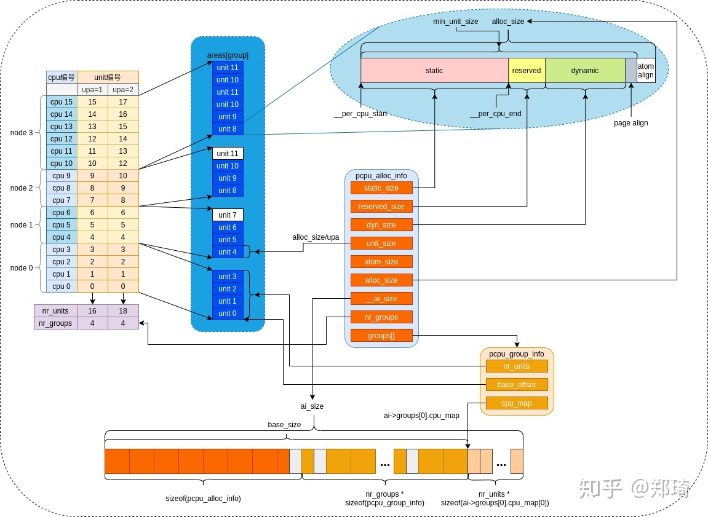

# 内核ELF中的percpu变量

## sym输出的疑问

sym输出的一些变量，为什么有些是低端内存地址，用户态空间，而非内核地址空间，这是什么玩法?

以vmw_steal_time为例

能知晓这是个结构体变量的地址，局部作用域，非内核空间虚拟地址

这什么变量这么牛皮，用户地址空间的内核局部变量？？

这是 percpu变量

正确打开姿势

用crash 中 p命令，能够打印percpu变量对应的内核地址空间中的虚拟地址

crash当前并没有提供直接获取percpu变量的命令，不过已经有补丁提交，还未合入，未来可期

* <https://crash-utility.redhat.narkive.com/q1huRMKH/patch-0-3-add-a-percpu-command>

## percpu变量

内核会为每个cpu分配

1. 用于内核静态percpu变量的static区域
2. 用于分配模块静态percpu变量的reserved区域
3. 第一块用于分配动态percpu变量的dynamic区域

* 每个CPU一个pcpu_alloc_info结构描述percpu元数据
* 每个percpu元数据包含不同类型的percpu变量
* static区域的大小依据内核源码中定义的静态percpu数量、大小而定，值为(__per_cpu_end - __per_cpu_start) ，
* 在arm64体系架构中，reserved区域大小默认为8KB（PERCPU_MODULE_RESERVE），dynamic区域大小默认为28KB（PERCPU_DYNAMIC_RESERVE）
* 在不同架构中，最小需要预留12KB。

## 参考

* <https://zhuanlan.zhihu.com/p/260986194>

---
